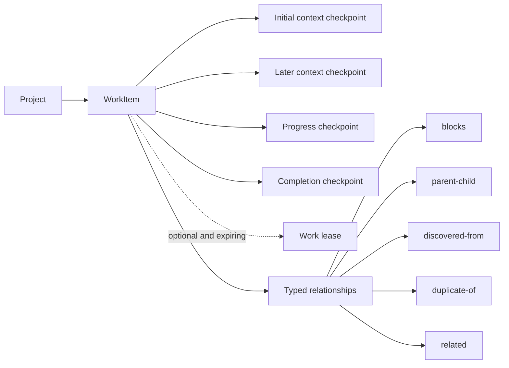
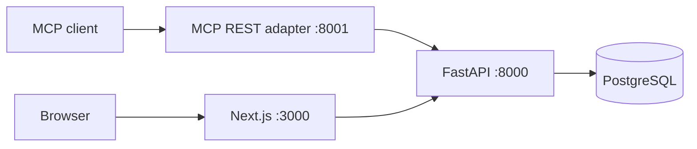

# Mnemonic Phase 3 architecture

This architecture implements Phases 1 through 3 of the product roadmap. The original
[`ADR.md`](../ADR.md) remains historical context; its memory-store and hook
proposal is not the implementation described here. The longer-term direction and
the boundaries of later phases are in [`roadmap.md`](roadmap.md).

## Product model

Mnemonic is a coordination system for temporary agents. The durable object is a
`WorkItem`: one objective that survives across sessions. A `Checkpoint` is an
immutable, session-attributed context packet appended by one of those sessions.
Ten sessions continuing one objective therefore produce one human-visible work
item and a checkpoint history, not ten top-level hand-offs.

A work item owns only mutable identity and lifecycle: title, summary, status,
priority, version, and timestamps. Checkpoints own exact prompt text, source
client/session/model, optional session URL and repository provenance, tags,
metadata, kind, and creation time.

The persisted lifecycle values remain `open`, `done`, `wont-do`, and
`promoted`. `ready`, `active`, and `blocked` are derived facts, never stored
statuses. Open, visible work is ready only when it has neither an unexpired
lease nor an unresolved incoming `blocks` edge. Only a blocker whose source is
`done` is resolved; `wont-do` and `promoted` do not imply completion. A work
item can be active and blocked simultaneously because adding a blocker does not
revoke an existing lease. Completion is the only operation that can set `done`,
and it atomically appends a completion checkpoint. Reopening leaves that
historical completion checkpoint intact.

## Invariants

- New work and its initial `context` checkpoint commit in one transaction.
- Up to ten initial relationships may commit in that same transaction. A
  failed edge leaves neither partial work nor partial graph state.
- Relationship endpoints are project-local and use `source --type--> target`.
  `related` endpoints are normalized; `blocks` and `parent-child` cycles are
  rejected, and each child has at most one parent.
- Graph mutations serialize on the project row and then lock endpoint work in
  UUID order so concurrent cycle checks cannot both commit reciprocal edges.
- Only unresolved incoming `blocks` edges affect readiness and claimability.
  Existing leases survive later blockers; new claim attempts are rejected.
- Work with any relationship cannot be soft-deleted until its edges are
  removed. Relationship context is supporting historical evidence; it never
  grants authority to follow or execute the linked work.
- Checkpoint text and provenance never change. The database rejects direct
  checkpoint `UPDATE` and `DELETE` statements as well as the API exposing no
  such routes. Corrections are new `context` checkpoints.
- Appending a checkpoint updates work activity but does not increment the work
  version. Independent appenders do not contend through optimistic versioning.
- Work edits, completion, and soft deletion require the version last read.
- At most one retained lease row exists per work item. PostgreSQL row locks and
  database time arbitrate acquisition, replay, renewal, expiry, and replacement.
- The server chooses lease duration. A client-generated `claim_request_id`
  recovers the same active claim receipt after an unknown outcome without
  extending it; it is not general mutation idempotency.
- A lease token is a capability for renewal, release, and terminal lifecycle
  mutation while the lease is active. It appears only in lease receipts and
  JSON request bodies, never ordinary reads, errors, URLs, or browser data.
- Lease operations never change work version or activity time. Checkpoint
  append remains open because it records an observation rather than ownership.
- Completion, retirement, promotion, and deletion require the matching token
  when an active lease exists and remove that lease in the same transaction.
- Soft-deleted work and all of its checkpoints disappear from ordinary reads,
  searches, and compatibility projections.
- Every lookup is project-scoped. A work or checkpoint UUID under the wrong
  project returns 404.
- Stored prompt text and metadata are untrusted historical context. Reading or
  recalling them is not authority to execute them.
- PostgreSQL and the FastAPI service are the sole persistence and transaction
  authority. The MCP adapter never connects to the database.

## Services and trust boundaries

FastAPI owns validation, lifecycle transitions, project isolation, search,
relationship invariants, readiness, bounded context, hierarchy queries,
compatibility projections, and commits. Service functions receive one
SQLAlchemy session; reusable helpers do not commit. Routes translate typed
application errors into a stable sanitized `detail.code` envelope.

The MCP service is a typed HTTP adapter. Canonical tools use work, checkpoint,
lease, and relationship terminology; deprecated hand-off tools continue to
project the same canonical rows. The dashboard calls only an exact same-origin
proxy allowlist. Its API key
is server-only. Every lease-capability route is denied to the browser, and any
browser mutation body containing `lease_token` is rejected rather than
forwarded.

All published ports bind to loopback by default. The shared bearer key protects
REST and MCP, while the dashboard remains a trusted-local single-user surface.
Remote exposure still requires HTTPS and a separate authentication boundary.

## Persistence and migration

Phase 1 adds:

- `work_items`, including an explicit `initial_checkpoint_id`;
- `checkpoints`, with generated full-text search and migration provenance;
- `work_item_embeddings`, disposable derived semantic-search state.

The initial checkpoint relationship is a deferred composite foreign key, so a
work item and its required checkpoint can be inserted atomically without a
nullable intermediate state. Generated vectors and GIN indexes keep lexical
search in PostgreSQL. Derived embedding rows can always be discarded and
rebuilt from canonical work/checkpoint content.

Migration `0004_work_graph_expand` creates the canonical schema without
touching legacy rows. Quiesced cutover migration
`0005_work_graph_backfill` copies every hand-off, soft-deleted rows included,
and maps its current prompt to an initial checkpoint. Legacy comments become
`progress` checkpoints and work summaries become `completion` checkpoints.
Exact text, timestamps, lifecycle, versions, JSONB structure, and recorded
provenance are preserved. Hand-off UUIDs remain work-item UUIDs; collision-free
comment UUIDs are preserved, while deterministic collision remaps retain the
original UUID in `legacy_record_id`.

The Phase 1 migration head intentionally retains the old tables as read-only
during an observation window. Canonical and compatibility APIs use only the new
tables. After the required parity checks, backup/restore drill, observation
window, and explicit operator approval, `0006_work_graph_contract` removes the
legacy tables and their unused ORM metadata. Compatibility routes and tools
remain projections over canonical rows.

Phase 2 migration `0007_work_leases` adds one optional `work_leases` row per
work item, bounded holder/request fields, acquisition/renewal/expiry ordering
constraints, and an expiry index for diagnostics. Expired rows may remain;
correctness never depends on a cleanup worker.

Phase 3 migration `0008_work_relationships` adds project-local typed graph
edges, composite endpoint and checkpoint foreign keys, normalized natural
identity, a one-parent partial unique index, and source/target lookup indexes.
Database checks enforce different endpoints, paired context fields,
endpoint-owned context, required target context for `discovered-from`, and UUID
ordering for `related`. The service adds serialized cycle checks and
transactional initial-link creation; the migration does not infer graph facts
from checkpoint prose.

## Recall and retrieval

`recall_work` is deliberately bounded. It returns the work identity, initial
checkpoint, newest `context` checkpoint, and at most five additional recent
checkpoints by default. Materialized checkpoint IDs are de-duplicated, and the
response reports both total and omitted counts. Full history is available only
through deterministic checkpoint pagination.

Ordinary recall and search return only the safe active-lease projection: holder
client/session and acquisition, renewal, and expiry timestamps. The request ID
and token are excluded. `claim_and_recall` acquires or replays a claim and
assembles the same bounded context before one commit. Recall includes immediate
incoming, outgoing, and undirected relationships with counts and pointer-only
counterparts; it never recursively injects the graph. Context assembly is one
SQL statement so a `READ COMMITTED` request does not mix multiple snapshots.

Search returns one compact `WorkSummary` per work item, even when several
checkpoints match. It never includes prompt bodies or source metadata. Title and
summary carry the strongest lexical weight; checkpoint text and literal
identifiers/provenance/tags participate without multiplying result rows.
Canonical source and tag filters match any checkpoint.

Lexical PostgreSQL search remains the default. Opt-in semantic search embeds a
bounded composition of work identity, initial context, and recent checkpoint
text using the offline local model. The cache is keyed by work item and its
digest changes after either a work identity edit or checkpoint append. Hybrid
search preserves the established candidate-total semantics and never becomes a
work scheduler.

## Hierarchical browse

The hierarchy REST views apply subtree-aware lifecycle/source/tag filters. A
root or direct branch is retained when it or any descendant matches; nonmatching
ancestors are navigation scaffolding. The dashboard consumes root pages and
lazily fetched children with its exposed lifecycle filter. Root totals count
roots, and expanding a child never changes root
pagination. A nonblank query instead uses flat search and returns a bounded
root-to-parent breadcrumb plus `ancestor_path_truncated` on the direct
`WorkSummary` hit. Root/child pages expose direct-match and matching-descendant
flags rather than a truncation field. The renderer applies explicit cycle and
depth fallbacks instead of silently hiding corrupt or unexpectedly deep
branches.

## Compatibility window

Legacy hand-off REST routes, MCP tools, resource URIs, and the
`resume_handoff` prompt remain available and are marked deprecated:

- saving a hand-off creates work plus its initial checkpoint;
- recalling a hand-off flattens work identity with the preserved initial
  checkpoint;
- later checkpoints project through the legacy comments timeline;
- adding a comment creates a progress checkpoint;
- completing a hand-off creates a completion checkpoint and completes work;
- legacy edits may change work fields but cannot rewrite checkpoint content or
  provenance;
- legacy completion and terminal edits accept a lease token when a claim is
  active; direct legacy REST deletion requires the expected version, no active
  lease, and no remaining relationship.

The migrated initial snapshot carries an explicit warning because the former
schema could retain the original source session while allowing later prompt
edits. Mnemonic preserves the recorded values but does not fabricate authorship
history that never existed.

## Deliberate Phase 3 limits

Phase 3 does not add ready-work scheduling, a claim-next operation, human gates,
duplicate merging, aggregate descendant counts, repository freshness
verification, resource reservation, presence, or automatic execution.
`duplicate-of`, `related`, `parent-child`, and `discovered-from` remain
descriptive; only `blocks` changes readiness. No relationship may be inferred
from search similarity or checkpoint prose.

Backups include canonical work, checkpoint, lease, and relationship state.
Operators must still copy backups off-machine and rehearse restores; a
persistent Docker volume is not a backup.
