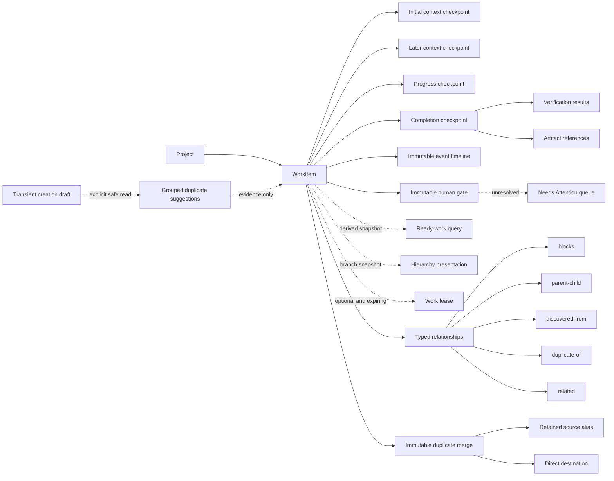
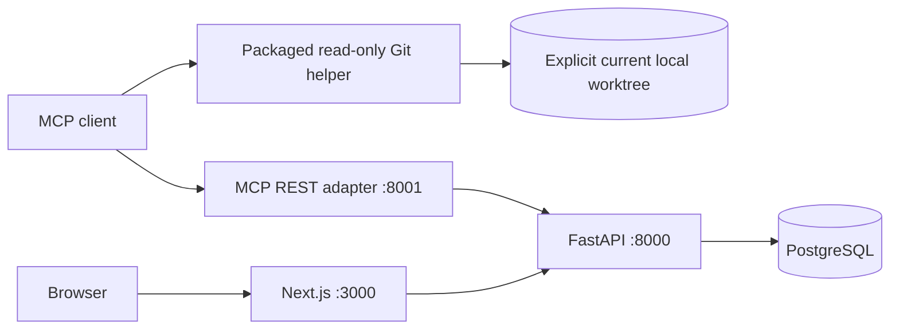

# Mnemonic architecture through Phase 11

This architecture describes application/API/MCP `0.6.0`, Claude plugin `0.10.0`,
and Alembic head `0019_structured_completion_evidence`. The longer-term
direction and later-phase boundaries are in [`roadmap.md`](roadmap.md).

## Product model

Mnemonic is a coordination system for temporary agents. The durable object is a
`WorkItem`: one objective that survives across sessions. A `Checkpoint` is an
immutable, session-attributed context packet appended by one of those sessions.
Ten sessions continuing one objective therefore produce one human-visible work
item and a checkpoint history, not ten top-level records.

A work item owns only mutable identity and lifecycle: title, summary, status,
priority, version, and timestamps. Checkpoints own exact prompt text, source
client/session/model, optional session URL and caller-asserted repository
branch/commit, an ordered declared dependency scope, tags, metadata, kind, and
creation time. The scope qualifies that exact immutable packet; it is not copied
between checkpoints or into events, pointers, search, or derived state.

Optional completion evidence is structurally owned by one exact completion
checkpoint. A `VerificationResult` reports a command or observation and an
outcome; an `ArtifactReference` records one bounded inert identifier. Both are
immutable caller assertions, not independently verified facts. They are absent
from ordinary work, search, readiness, hierarchy, event, and recall projections.
The dedicated event-backed history read exposes them only beside the compact
completion pointer that owns them.

A `WorkEvent` is a concise immutable fact in one work item's history. It can
reference a checkpoint, lease generation/release action, or complete
relationship snapshot without copying checkpoint text or capability-bearing
request fields. Server-reserved events are constructed only by the mutation
that proves them. Clients can append only bounded `progress`; that does not
replace resume context and does not increment the work version.

The live `WorkItem` lifecycle values are `pending`, `deferred`, `done`,
`wont-do`, and `promoted`; current work-item responses never return `open`.
Historical `WorkEvent` snapshots may retain legacy `open`, while new events use
Pending/Deferred values. Pending means no session has started or work remains
incomplete; Deferred is an intentional human-controlled hold outside the agent queue.
`active`, `dropped`, `blocked`, `waiting`, and `duplicate` are derived facts. Active means an
unexpired lease exists; Dropped means the retained lease expired unexpectedly;
Waiting means at least one unresolved human gate exists. Pending, visible work
is ready only when it has no unexpired lease, unresolved incoming `blocks` edge,
unresolved human gate, or authoritative outgoing duplicate merge. Only a blocker whose source is `done` is resolved;
`wont-do` and `promoted` do not imply completion. A work item can be active,
blocked, and waiting simultaneously because later facts do not revoke an
existing lease. Duplicate has display precedence over Waiting, but the
independent flags remain authoritative. Completion is the only operation that can set `done`, and it
atomically appends a completion checkpoint. Reopening leaves that historical
completion checkpoint and its evidence intact. A correction is a later explicit
reopen-and-complete episode, never an edit or late append to frozen evidence.

A descriptive `duplicate-of` relationship is a duplicate mark, not a canonical
decision. An authoritative merge permanently records one exact
`source --duplicate-of--> direct destination` decision. The source becomes a
retained alias whose stored lifecycle and source-owned checkpoints, events,
gates, provenance, relationships, and receipts do not change. Following at most
50 immutable destination edges identifies the current canonical root. No read
redirects the requested ID, and no operation coalesces content, lifecycle,
relationships, leases, gates, provenance, or authority into the destination.

Ready discovery runs the same nonrecursive blocker/lease/gate/alias predicate used by
a fresh or replacement claim and returns only compact pointers. Its order is `priority DESC,
created_at ASC, id ASC`; tag and direct-parent filters do not change
eligibility. A page is one statement snapshot, not a reservation. Concurrent
changes can shift offset pages, and `claim_and_recall` remains the authority
that locks and revalidates before already-authorized execution.

## Invariants

- New work and its initial `context` checkpoint commit in one transaction.
- Up to ten initial relationships may commit in that same transaction. A
  failed edge leaves neither partial work nor partial graph state.
- Relationship endpoints are project-local and use `source --type--> target`.
  `related` endpoints are normalized; `blocks` and `parent-child` cycles are
  rejected, and each child has at most one parent.
- Graph mutations serialize on the project row and then lock endpoint work in
  UUID order so concurrent cycle checks cannot both commit reciprocal edges.
- Authoritative duplicate merges form a project-local immutable forest. Each
  source has at most one outgoing merge, endpoints are current distinct roots,
  cycles and a 51st edge fail closed, and several alias branches may converge.
- Migration 0016 does not reinterpret or backfill historical `duplicate-of`
  relationships. Every fresh duplicate mark must instead be the exact
  same-transaction witness of `merge_work`; a pre-0016 completed generic
  relationship receipt still replays before the fresh-write guard.
- Merge retains or creates the exact source-to-destination mark, increments both
  endpoint versions at one database timestamp, consumes only the source lease
  when its exact token is supplied (or clears an expired lease), appends exactly
  two `work_merged` events, and commits its mandatory receipt atomically.
- An alias is never ready or claimable. New alias checkpoint, event, gate,
  lifecycle, lease, and relationship mutations fail without redirect; every
  source-incident relationship is frozen. Raw exact history remains readable
  and the canonical continuation is an explicit, separate projection.
- Only unresolved incoming `blocks` edges, unresolved human gates, and an
  authoritative outgoing merge affect readiness and fresh/replacement
  claimability. Existing leases survive a later blocker or gate; a merge
  consumes the source lease before making that source an alias.
- A gate request freezes the work version, newest context-checkpoint ID, and
  relationship-event count as a nested `requested_context_revision`; the gate and exact `human_attention_requested` event
  commit atomically. Resolution is one immutable transition with an exact
  `human_attention_resolved` event and an exact current revision reviewed on every
  resolution. Stable
  request-known credentials and operation controls are rejected before receipt
  reservation; replay and conflict return before a genuinely new execution.
  Public gate IDs are not credentials, and there is no database-wide retained-UUID
  content scan. This exact-match check is not a universal secret detector.
- An unresolved gate rejects completion, terminal transitions, and deletion at
  both the service and PostgreSQL layers. Identity edits, deferral/Pending
  restoration, checkpoints, progress, and relationship changes remain possible.
- A work mutation and every authoritative event it proves share one transaction.
  Claim/relationship replay, absent removal/release, and renewal emit nothing.
- A protected mutation's project-scoped receipt, domain changes, and events
  share that transaction. A committed receipt is immutable and replays its
  validated original status/body before current resource visibility or lifecycle
  checks; a rolled-back attempt leaves no receipt.
- At most one receipt exists for a `(project_id, client_operation_id)`. Its
  salted fingerprint binds operation kind, path target, actor, version,
  capability, and normalized semantic body. A mismatch fails closed rather than
  executing a second intent.
- A completion checkpoint, pending-to-done transition, completion event,
  optional evidence children, matching lease departure, and optional receipt
  commit atomically. Evidence cannot be created through any other route.
- Every evidence child repeats the exact project/work/completion parent,
  receives a contiguous zero-based position within its family, and shares the
  completion checkpoint timestamp. At most 20 children and 32,768 charged
  caller-string bytes belong to one episode.
- Private completion generations join the live work, completion checkpoint,
  completion event, and exact successor reopen. New generations are monotonic;
  migrated completions retain deterministic negative identities. Every page,
  audit, and deferred database guard fails closed on a missing, crossed,
  reordered, duplicate, or unsealed episode.
- Verification and artifact tables reject direct `UPDATE`, `DELETE`, and
  `TRUNCATE`. Deferred database validation also prevents manufacturing an
  eventless evidence-bearing completion or stranding children by changing a
  parent after insertion.
- Event rows are immutable through both the route surface and PostgreSQL
  `UPDATE`/`DELETE` trigger. Per-work order is `created_at, id`; the identity is
  a tie-breaker, not a project activity cursor or commit-order promise.
- Event actor fields are asserted client provenance. They are never inferred
  from the bearer credential, transport, retained lease holder, relationship
  creator, or dashboard label. Older direct REST writes that omit a newly
  optional actor are stored honestly as `unattributed`.
- Server-reserved constructors do not accept bearer, lease-token, or claim-ID
  fields. Public progress rejects request-known credential/capability echoes,
  but accepted opaque text may still contain sensitive material the service
  cannot recognize and returns exactly to authorized history readers.
- Work with any relationship cannot be soft-deleted until its edges are
  removed, and work with any unresolved gate cannot be soft-deleted or moved
  terminal. Relationship context is supporting historical evidence; it never
  grants authority to follow or execute the linked work.
- Checkpoint text and provenance never change. The database rejects direct
  checkpoint `UPDATE` and `DELETE` statements as well as the API exposing no
  such routes. Corrections are new `context` checkpoints.
- An affected-path declaration has at most 64 preserved ASCII patterns, each at
  most 512 bytes and together at most 16 KiB. Non-empty scope requires a
  caller-asserted checked commit. Empty means unknown scope and is canonically
  omitted; `**` is the explicit whole-eligible-repository declaration.
- Appending a checkpoint updates work activity but does not increment the work
  version. Independent appenders do not contend through optimistic versioning.
- Work edits, completion, and soft deletion require the version last read.
- At most one retained lease row exists per work item. PostgreSQL row locks and
  database time arbitrate acquisition, replay, renewal, expiry, and replacement.
- The server chooses lease duration. A client-generated `claim_request_id`
  recovers the same active claim receipt after an unknown outcome without
  extending it; it is not general mutation idempotency.
- A lease token is a capability for renewal, release, and terminal lifecycle
  mutation while the lease is active. It appears only in lease receipts and
  JSON request bodies, never ordinary reads, errors, URLs, or browser data.
- Lease operations never change work version or activity time. Checkpoint
  append remains open because it records an observation rather than ownership.
- Completion, retirement, promotion, and deletion require the matching token
  when an active lease exists and remove that lease in the same transaction.
- Soft-deleted work and all of its checkpoints disappear from ordinary reads
  and searches, including ordinary evidence history. Its immutable gate history
  remains readable only through an exact project/work ID. Completion-evidence
  rows remain stored for operator audit and receipt replay.
- Every lookup is project-scoped. A work or checkpoint UUID under the wrong
  project returns 404.
- Stored prompt text and metadata are untrusted historical context. Reading or
  recalling them is not authority to execute them.
- PostgreSQL and the FastAPI service are the sole persistence and transaction
  authority. The MCP adapter never connects to the database.
- The API, MCP adapter, and browser never inspect, mount, identify, fetch, or
  assess a repository. Only the installed local plugin helper reads the
  explicitly selected current Git worktree. Its ephemeral three-state evidence
  is advisory and never persisted or converted into authority.
- `client_operation_id` is private control data. It is accepted only at the
  top level of the thirteen enrolled REST request bodies, never persisted in domain
  models/events or returned through public read surfaces.

## Services and trust boundaries

FastAPI owns validation, lifecycle transitions, project isolation, canonical
duplicate resolution and merge, search,
the reusable readiness predicate/query, relationship invariants, immutable
event and human-gate construction/listing, attention cursors, bounded context,
hierarchy presentation queries, idempotency
receipt reservation/replay, and commits. Service functions receive one
SQLAlchemy session; reusable helpers do not commit. The closed operation
registry is the only path that can canonicalize, reserve, validate a stored
response, or complete a receipt. Routes translate typed application errors into
a stable sanitized `detail.code` envelope.

The FastAPI service is the `mnemonic_api.application` package, and `create_app`
only assembles it. `middleware` fixes what wraps every request and in which
order: the bearer check before routing, then outcome logging and the live-sync
broadcast after the response. `auth`, `guards`, and `validation` hold the
boundary rules for credentials, capability transports, and sanitized validation
errors. `mutations` holds the one lifecycle every receipt-protected write shares
(reserve, replay or execute, complete, commit, trace), so a route contributes
only its domain work. `handlers` renders the two failure classes that escape
routes. `routes/` has one module per concept: `projects`, `work_search`,
`work_items`, `history` (checkpoints and events), `relationships`,
`human_gates`, `completion_evidence`, `leases`, `duplicates`,
`dashboard_sync`, and `health`.

The MCP service is a typed HTTP adapter. Its eleven protected mutation tools
require the caller to prepare and retain one operation UUID plus the complete
arguments; the adapter sends only one HTTP attempt. Its other tools use work,
checkpoint, lease, relationship, human-gate, evidence, and duplicate terminology. Its exact
28-tool
catalog includes request, attention, and gate-history operations but deliberately
no resolution tool; `list_completion_evidence` is the sole new safe read,
`merge_work` is its only authoritative duplicate mutation,
while `suggest_duplicate_work` is an independently retryable safe read.
Full checkpoint models transport non-empty `affected_paths` declarations;
compact pointers remain scope-free. The adapter has no Git, subprocess,
filesystem, repository-root, branch-resolution, or freshness-result surface.
It also never executes evidence or dereferences artifacts. Bounded identity-only
history transport and pre-SDK HTTP/stdio frame guards prevent content coding,
oversized bodies, or unbounded caller IDs from defeating the result envelope.
The dashboard calls only an exact same-origin proxy
allowlist, including attention/history reads, gate resolution, event
list/progress append, and actor-bearing work or relationship writes. A dashboard-lifetime in-memory
registry owns eleven frozen protected intents, including a two-work-key merge
intent, and blocks overlapping conflicts while an
outcome is unresolved, and never writes those bodies or UUIDs to browser
storage. Its API key is server-only. Every lease-capability route
is denied to the browser, event append rejects a browser lease token, and any
browser mutation body containing `lease_token` is rejected rather than forwarded.

All published ports bind to loopback by default. The shared bearer key protects
REST and MCP, while the dashboard remains a trusted-local single-user surface.
Remote exposure still requires HTTPS and a separate authentication boundary.
Requester and resolver provenance is asserted under that shared bearer; it is
not authenticated human identity, an approval signature, or independent
verification of an answer.

## Persistence and migration

Phase 1 adds:

- `work_items`, including an explicit `initial_checkpoint_id`;
- `checkpoints`, with generated full-text search and migration provenance;
- `work_item_embeddings`, disposable derived semantic-search state.

The initial checkpoint relationship is a deferred composite foreign key, so a
work item and its required checkpoint can be inserted atomically without a
nullable intermediate state. Generated vectors and GIN indexes keep lexical
search in PostgreSQL. Derived embedding rows can always be discarded and
rebuilt from canonical work/checkpoint content.

Migration `0004_work_graph_expand` creates the canonical schema without
touching legacy rows. Quiesced cutover migration
`0005_work_graph_backfill` copies every hand-off, soft-deleted rows included,
and maps its current prompt to an initial checkpoint. Legacy comments become
`progress` checkpoints and work summaries become `completion` checkpoints.
Exact text, timestamps, lifecycle, versions, JSONB structure, and recorded
provenance are preserved. Hand-off UUIDs remain work-item UUIDs; collision-free
comment UUIDs are preserved, while deterministic collision remaps retain the
original UUID in `legacy_record_id`.

The Phase 1 migration head retained the old tables as read-only during an
observation window. After the required parity checks, backup/restore drill,
observation window, and explicit operator approval,
`0006_work_graph_contract` removed the legacy tables and their unused ORM
metadata. Every API and MCP surface reads the canonical tables.

The migrated initial snapshot carries an explicit warning because the former
schema could retain the original source session while allowing later prompt
edits. Mnemonic preserves the recorded values but does not fabricate authorship
history that never existed.

Phase 2 migration `0007_work_leases` adds one optional `work_leases` row per
work item, bounded holder/request fields, acquisition/renewal/expiry ordering
constraints, and an expiry index for diagnostics. Expired rows may remain;
correctness never depends on a cleanup worker.

Phase 3 migration `0008_work_relationships` adds project-local typed graph
edges, composite endpoint and checkpoint foreign keys, normalized natural
identity, a one-parent partial unique index, and source/target lookup indexes.
Database checks enforce different endpoints, paired context fields,
endpoint-owned context, required target context for `discovered-from`, and UUID
ordering for `related`. The service adds serialized cycle checks and
transactional initial-link creation; the migration does not infer graph facts
from checkpoint prose.

Phase 4 migration `0009_ready_work_indexes` adds the partial
`ix_work_items_ready_order` index and an immutable normalized-tag SQL function
with a matching GIN expression index. Readiness remains derived; there is no
queue table, persisted ready flag, scheduler, or background refresh process.

Phase 5 migration `0010_work_events` assigns a nonsecret generation UUID to
every retained lease, adds the transaction-only release marker, and creates
`work_events`. Typed checkpoint, lease, and complete relationship references,
event-specific metadata checks, source-fact/deferred-state guards, unique fact
indexes, and an immutability trigger keep stored history tied to its retained
domain fact. Removal/release events retain action IDs after their mutable edge
or lease row is gone; retained work/checkpoint endpoints remain foreign keyed.

The migration reconstructs only provable facts: creation, later checkpoints,
completion checkpoints, retained relationships and leases, and soft deletion.
Every reconstructed row has `origin=backfill`; later updates, reopenings,
releases, removals, and expired/replaced leases are not invented. A complete
stable candidate sort precedes identity allocation. Ordinary reads hide event
history after soft deletion, while the rows remain available to operator
audit.

Migration `0011_project_settings` adds the optional per-project recall pointer
template. Migration `0012_pending_deferred_statuses` then introduces the
Pending/Deferred lifecycle split. Phase 6 therefore uses
`0013_idempotent_mutations` on the final integrated history.

`0013_idempotent_mutations` adds the private `client_operations` ledger with
exact project/UUID uniqueness, versioned salted SHA-256 request fingerprints,
bounded JSON response receipts, and pending/completed invariants. It
intentionally has no project or resource foreign keys: replay must survive
soft deletion and avoiding those foreign-key locks preserves the established
project-first graph lock order. Insert/update/delete and deferred-completion
triggers allow only a pending insert followed by one completion in the same
transaction; pending rows cannot commit, and completed rows cannot change or
be deleted.

The same migration adds a separate recursive
`client_operation_id` progress-metadata check as `NOT VALID`. Historical
metadata remains readable and unchanged, while every new or updated progress
row must satisfy the Phase 6 reservation. The Phase 5 metadata-v1 validator is
not rewritten.

`0014_human_gates` creates `work_gates` with project/work scope, immutable
request and resolution provenance, request/current/resolved revision anchors,
and an identity-backed attention sequence. It adds the internal nullable
gate reference to `work_events`, typed request/resolution metadata, exact-event
uniqueness, and source-fact checks. Deferred completeness triggers require an
unresolved gate plus request event at commit and require the single resolution
transition plus resolution event together. Gate/event updates, unresolution,
and deletion fail closed.

The migration widens the private receipt registry to exactly twelve kinds and
preserves every existing work, event, metadata value, and completed receipt. A
separate `NOT VALID` check reserves top-level gate metadata on new non-gate
events without retroactively invalidating historically legal progress metadata.
The request schema recursively rejects case-insensitive `gate_id` and
`gate_type` progress metadata before receipt reservation, while the response
metadata model remains permissive enough to read preserved historical rows.
Lease and work triggers prevent a stale application from inserting/replacing a
lease or committing terminal/delete state while a gate is unresolved; same-
generation renewal/release remains possible.

`0015_gate_review_fixes` changes canonical checkpoint and relationship creation
defaults to `clock_timestamp()` so a transaction that waited on a lock cannot
backdate its context behind the gate it creates. It drops the redundant
persisted `context_change_acknowledged` and
`context_changed_at_resolution` fields, rewrites the gate completeness triggers
around the reviewed revision, and preserves all existing gate, event, and
receipt rows. The read model still computes current drift flags and the nullable
resolution-drift convenience field from retained revision anchors. Migration 0015
deliberately has no downgrade: deployments fix forward or restore a complete
chosen archive with an explicit data-loss boundary.

`0016_duplicate_handling` creates the initially empty
`work_duplicate_merges` ledger with immutable project-scoped source,
destination, reviewed revisions, resulting versions, exact supporting
relationship, rationale, asserted provenance, sequence, and timestamp. It adds
private deferred witnesses to newly created supporting relationships and their
paired events, private references for the two new `work_merged` events, a unique
source anti-join index used by readiness/claim, reverse/audit indexes, and
database guards for completeness, depth, alias freeze, and stale writers.
Those private witness columns never enter public `WorkEventRead` or any preserved
receipt-bearing Phase 1–8 shape.

The migration preserves every existing row and byte of work, checkpoint,
relationship, lease, event, gate, embedding, receipt, identity, timestamp,
version, body, hash, and provenance. It creates zero merges or witnesses from
historical marks. Migration 0016 has no downgrade. Before a Core write, an
operator can restore the complete pre-0016 archive with matching Phase 8
binaries; after any merge or Core receipt, correction is a whole-database
restore that knowingly loses every later write, or a future reviewed append-only
correction release.

`0017_duplicate_suggestion_title_key` rewrites no work content and creates no
canonical fact. It adds the immutable PostgreSQL-17
`mnemonic_duplicate_title_key_v1(text)` function—NFKC normalization, POSIX
whitespace trim/collapse, and lowercase under C collation—and a partial
expression index over visible work `(project_id, title_key, id)`. SQLAlchemy
metadata declares the same index expression. Unlike 0016, 0017 supports a
schema-only downgrade to Core by dropping those derived objects; it has no
domain facts to reverse. The widened Alembic revision column remains at
64 characters because the mandated 0017 revision ID exceeds the historical
32-character capacity; no application content changes.

`0018_repository_freshness` adds
`checkpoints.affected_paths VARCHAR(512)[] NOT NULL DEFAULT '{}'` plus the
versioned immutable `mnemonic_affected_paths_valid_v1(varchar[])` validator.
Database constraints enforce the exact one-dimensional ASCII grammar, count,
per-entry and aggregate byte bounds, case-sensitive exact uniqueness, and the
non-empty-scope/`verified_against` dependency. Every historical row receives
only the empty array; no text, tag, metadata, relationship, branch, or checkout
is interpreted to infer scope. The existing checkpoint immutability trigger
protects the new column, and there is no scope index. Downgrade takes an
exclusive table lock and refuses before DDL once any non-empty declaration
exists; after scoped use, recovery is fix-forward or a whole-database restore.

`0019_structured_completion_evidence` adds `verification_results` and
`artifact_references` as immutable composite children of exact completion
checkpoints. It also adds private `completion_generation` state to work and
completion checkpoints and private `reopen_generation` witnesses to reopen
events. Existing completion checkpoints are paired only with their already
retained `work_completed` events and receive deterministic negative generation
identities; every evidence table begins empty. No historical prompt, metadata,
event, receipt body, version, time, or identifier is rewritten.

Database constraints cover strict vocabularies, string and byte bounds,
type-dependent command/exit-code and artifact-reference grammars, family
position uniqueness, same-project ownership, and duplicate artifact identities.
Regular and deferred triggers enforce insertion only inside a live canonical
completion transition, exactly one completion event per checkpoint, monotonic
event identity and work version, the exact successor reopen for older runtime
generations, current-done correspondence, and global sealed-episode coherence.
Mutation and truncate guards make both child tables append-only. A partial
completion-event access index supports the page-first history query. Dedicated
checkpoint-first indexes on both child tables and a unique partial checkpoint/work
receipt-expression index keep the content-free, checkpoint-global
receipt/row-correspondence audit bounded by indexed probes rather than the
unrelated evidence or receipt inventory.

Downgrade locks every affected table and refuses before DDL when either evidence
table is nonempty, any Phase 11-only completion receipt response is present, or
retained completion/reopen chronology cannot round-trip safely. Eligible
evidence-free databases return to that database's exact incoming approved raw
Phase 10 survivor-catalog representation. PostgreSQL 17 migration-built and
shipped-backup-restored survivor projections have two explicitly frozen raw
digests because dump/restore reparses CHECK and partial-index expressions; no
generic normalization or third projected form is accepted. Otherwise recovery
is fix-forward or a consciously selected whole-database restore.

## Idempotent mutation execution

The thirteen enrolled REST operations are create work, add checkpoint, append
event, add relationship, update, defer, complete, delete, remove relationship,
release claim, request human input, resolve human input, and merge work. Direct
REST makes the operation UUID optional for the original twelve only when
completion evidence is absent or empty; non-empty completion evidence and every
merge require it. Canonical MCP requires it for eleven tools: the previous ten plus merge;
defer and gate resolution remain human control-plane actions without MCP tools.
The browser keys eleven non-capability mutations: the previous ten plus merge,
while gate creation and release remain proxy-denied. Project administration,
claim, claim-and-recall, and renewal are explicitly excluded.

For a keyed request the service validates secrets and canonicalizes the entire
semantic envelope before any domain lookup. Defaults and nulls are explicit,
JSON object keys are sorted, initial relationship order is normalized, and
undirected `related` endpoints are normalized. It inserts the pending receipt
first. A conflicting in-flight insert waits for at most
`MNEMONIC_CLIENT_OPERATION_WAIT_SECONDS`; after the owner commits, an exact
waiter validates and returns the stored response. Timeout or an unverifiable
receipt fails closed. Fresh execution then uses the pre-existing domain lock
order and completes the receipt before the route's sole commit.

Live synchronization carries only `{type, revision, scope}` control fields;
there is no project, work, gate, receipt, count, or content identifier in a
frame. The dashboard conservatively refreshes its selected scope. A first execution
publishes only when it applied domain work; a natural no-op publishes nothing.
An exact replay republishes the data-free invalidation only when the stored
`mutation_applied` was true, healing a browser that lost the first response.
The receipt itself has no public endpoint, TTL, cleanup job, or resource foreign
key.

Checkpoint mutation receipts remain response-contract version 1. A newly
completed receipt stores the canonical sparse checkpoint representation:
`affected_paths` is present only when non-empty. Historical response bytes are
never rewritten or synthesized. Replay accepts both the historical shape with
the member absent and the new non-empty shape, while rejecting an explicit
empty member as an unverifiable protected response.

Completion receipts also remain version 1. Their response is exactly the
historical `{work_item,checkpoint}` shape when no evidence exists; a new
evidence-bearing receipt adds one nonempty `completion_evidence` object whose
two arrays are always present. Receipt replay revalidates the permanent
receipt's internal child ownership, positions, timestamps, and canonical
request correspondence without changing a stored byte or consulting current
evidence rows or work visibility. The read-only audit, rather than replay,
detects any later receipt-to-row divergence.

## Completion-evidence history

The safe history path begins with retained `work_completed` events rather than
scanning completion checkpoints or evidence children independently. One
repeatable-read snapshot computes live work/canonical identity, the stable
maximum completion-event high-water mark, total episode counts, and a page of at
most ten events. Only then do two ordered family queries assemble children for
that page. This avoids a result/artifact Cartesian product and keeps query count
constant as a page grows. Every selected private generation is revalidated by
the sealed-episode database function before projection.

Event identities cross the wire as canonical decimal strings so JavaScript does
not round PostgreSQL bigint values. Continuation cursors are bounded canonical
base64url JSON scoped to endpoint, direction, project, exact work, high-water
event, and last event. They are opaque pagination state, not signed capability
or authority. A fresh completion cannot move an in-progress traversal because
every continuation retains the first page's high-water mark; page-level
lifecycle/version/current-pointer fields still describe each request's live
snapshot. A current completeness audit exhausts a cursor chain and then compares
a new first-page identity tuple.

The API rejects any serialized page over 3 MiB. MCP and Next request identity
coding, reject a non-identity header before reading, and incrementally retain at
most the same byte ceiling before strict parsing. The nginx reference deployment
disables transformation, compression, buffering, and caching for the same-origin
API path. MCP separately guards every inbound HTTP entity and stdio record at
1 MiB and caps the SDK's complete duplicated JSON-RPC evidence result at 12 MiB.

## Recall and retrieval

`recall_work` is deliberately bounded. It returns the exact requested work identity, initial
checkpoint, newest `context` checkpoint, and at most five additional recent
checkpoints by default. If the initial checkpoint is still current,
`current_context` is null and `current_context_is_initial` directs clients to
the single materialized initial body. It also returns ten recent events by
default, chronologically, with a maximum of 20. Checkpoint and event totals,
omission counts, and the backfill-based partial-history flag describe the whole
history independently of the returned slice. Full history requires explicit
checkpoint or event pagination. Context also includes bounded unresolved and
recent-resolved gate slices with exact totals/omitted counts; focused human
review can require a named unresolved gate in the one-snapshot response, while
complete paired decisions use cursor-paged gate history.

Every materialized full checkpoint preserves a non-empty declared
`affected_paths` list byte-for-byte and in caller order. Pointer projections,
events, search hits, relationship counterparts, and other derived summaries
omit the declaration. Callers that need declarations outside bounded recall
page full checkpoint history explicitly.

Ordinary recall and search return only the safe active-lease projection: holder
client/session and acquisition, renewal, and expiry timestamps. The request ID
and token are excluded. `claim_and_recall` acquires or replays a claim and
assembles the same bounded context before one commit. Recall includes immediate
incoming, outgoing, and undirected relationships with counts and pointer-only
counterparts; it never recursively injects the graph. Ordinary recall caps each
relationship direction at 100 in Phase 9. It also returns an exact
`MergeReviewRevision`, canonical projection, at most 20 duplicate member
pointers, exact member/omission totals, omitted relationship counts, and source
merge-eligibility facts. An alias response retains only that alias's checkpoint,
event, gate, and relationship history; clients explicitly read its canonical
root when continuation context is needed. The exact nested review route for a valid unresolved gate deliberately
materializes every adjacent edge in that same statement so the dashboard can
fail closed unless the human review is complete; its payload and counterpart
projection cost scale with focal degree. Context assembly is one SQL statement
so a `READ COMMITTED` request does not mix multiple snapshots.

Search returns `WorkSearchHit` rows containing a canonical `summary` and the
exact `matched_member` pointer. The default `duplicate_scope=canonical` groups
all matching members under one root before pagination; explicit `aliases` and
`all` scopes retain audit access and may be narrowed with a canonical root ID.
It never includes prompt bodies or source metadata. Title and
summary carry the strongest lexical weight; checkpoint text and literal
identifiers/provenance/tags participate without multiplying result rows.
Canonical source and tag filters match any checkpoint.

Lexical PostgreSQL search remains the default. Opt-in semantic search embeds a
bounded composition of work identity, the first 1,500 initial-prompt
characters, and a SQL-bounded 1,500-character tail across later checkpoints
using the offline local model. Its derived cache is keyed by work item and its
digest changes after either a work identity edit or checkpoint append. Cache
refresh happens after the response snapshot, skips locked work rows, and uses a
50 ms lock timeout plus a five-second statement timeout. Those bounded cache
timeouts preserve the computed ranking; other semantic failures remain typed
`semantic_unavailable`. Hybrid search preserves the established
candidate-total semantics and never becomes a work scheduler.

Duplicate suggestions are a separate safe-read POST over one complete,
transient creation draft. The response reserves globally indexed exact-title
groups before other lanes, retains at most 200 non-exact lexical canonical
groups, and optionally fuses local semantic rank with lexical rank using the
versioned `duplicate-suggestion-v1` composition. Existing-work text includes
at most the 30 most-recent distinct normalized tags, selected by latest
checkpoint occurrence and emitted lexicographically; `tags=recent-30` is part
of the disposable cache version. A full-project semantic claim
requires at most 10,000 visible members and current cached vectors for all of
them; otherwise the response declares shortlist-only coverage and computes at
most 128 missing vectors. Model load, capacity, inference, vector, or derived
cache failure falls back to deterministic lexical success.

Each result is one canonical group with the exact matched member, rank, and an
ordered subset of categorical `exact_title`, `lexical`, and `semantic` signals.
It exposes no scores, vectors, checkpoint bodies, provenance, readiness
capability, merge control, or lease/gate detail. The query vector and result are
never stored. Candidate title and summary retain their exact stored string values;
create-draft trimming is not reapplied. Existing-work vector cache writes occur
after the coherent candidate snapshot in a separate digest-checked transaction,
skip locked work rows, and publish no event or live-sync invalidation.

The authenticated route has a 2,097,152-byte streaming body cap, four request
slots with a 250 ms wait, a ten-result maximum, and an absolute 60-second
transport budget. A single process-wide inference slot is shared with ordinary
semantic search. Suggestions wait 50 ms for it and then use lexical results;
saturated ordinary semantic search returns typed `semantic_unavailable`.
Capacity is acquired before a database session. PostgreSQL-17 suggestion
transactions derive transaction, statement, and lock timeouts from the
remaining request budget, and post-snapshot cache lock waits are further capped
at 50 ms. Request saturation returns typed 429 with `Retry-After: 1`;
database/system failure returns typed 503. Neither state changes or disables
the ordinary creation path.

## Hierarchical human presentation

Root and child hierarchy pages are a human presentation over the parent-child
graph. The dashboard collapses descendants by default and lazily
loads direct children, while each `HierarchySummary` carries one-statement
branch aggregates: direct children; strict descendants; blocked, active,
completed, and discovered descendants; inclusive unresolved human gates;
discovery labels for the current node; the earliest active descendant lease
expiry; and the number of merged aliases in the branch. Alias rows are not
hierarchy nodes. Counts are independent rather than mutually exclusive, so one
descendant may be active, blocked, and gated.

Lifecycle/source/tag filters are subtree-aware. A root or direct branch is
retained when it or any descendant matches; `self_matches_filter` and
`has_matching_descendants` explain when a muted ancestor is only navigation
scaffolding. Root totals count qualifying roots, direct-child totals count
qualifying branch children, and the presentation counts remain unfiltered
facts about the complete branch. The service computes the page, total,
aggregates, filter flags, and database-time lease state in one PostgreSQL
statement rather than a Python walk or per-branch query. It disables JIT for that transaction, pages before computing member facts, and applies a five-second statement timeout translated to typed `hierarchy_timeout`.

Every flat full-view search/browse row returns a bounded root-to-parent breadcrumb
plus `ancestor_path_truncated`; a structural root legitimately has an empty path. Planned children
and `discovered-from` work have distinct presentation labels; discovered work
without that parent relationship remains a top-level root. The renderer applies
explicit cycle and depth fallbacks instead of silently hiding corrupt or
unexpectedly deep branches, and schedules passive refresh from the earliest
visible descendant lease expiry.

## Deliberate Phase 11 limits

Ready discovery is not automatic scheduling and there is no
`claim_next_ready_work`. The receipt ledger still excludes project
administration, claim, claim-and-recall, and time-anchored renewal. Human gates
support only the `human` type: no timers, CI/external-event gates, automatic
expiry, escalation, notification delivery, authenticated approval signatures,
or agent-facing resolution operation exists. A stored question/answer is
untrusted context under a shared bearer, not verified human identity or renewed
execution authority.

Only explicit authoritative merging changes duplicate identity. A bare `duplicate-of`
mark, `related`, `parent-child`, and `discovered-from` remain descriptive; only
an authoritative merge makes its source a non-actionable alias. Suggestions are
explicit, transient, and evidence-only. The release has no automatic merge,
per-keystroke suggestion, creation suppression, unmerge/split/retarget, ID redirect, claim substitution,
relationship transfer, content or lifecycle coalescing, repository freshness
enforcement, resource reservation, or automatic execution. Repository
freshness is a local, caller-selected advisory check over a declared dependency
scope; it is not semantic proof, execution authority, or a server-side Git
operation. No relationship,
merge, or human answer may be inferred from similarity or checkpoint prose.

The per-work event identity is not a durable project activity cursor. The gate
attention cursor is purpose-built from immutable request sequence and identity;
because allocation can precede commit, complete consumers restart from the head
once before declaring the queue drained;
it does not create a general `get_activity`, notification broker, SSE/webhook
feed, or passive lease-expiry event.

Completion evidence has no standalone create/update/delete operation, mutable
status, overall score, automatic gate, CI callback, artifact fetch, command
execution, signature, attestation, search index, or ordinary recall embedding.
A late result does not mutate an old episode: clients keep work pending, append
narrative context, or explicitly reopen and complete again. The first version
supports only command/observation results and seven inert artifact types.

Backups include canonical work, checkpoints, leases, relationships,
authoritative duplicate merges and their witnesses, immutable
events and their sequence, human gates and attention sequence, durable
client-operation receipts (including historical and scoped checkpoint response
shapes), ordered checkpoint dependency declarations, completion generations,
reopen witnesses, immutable verification results and artifact references,
migration state, and archived ACL commands for public-schema application
objects. Ownership is rebound to the fixed application role during restore,
while object-ACL replay preserves Phase 11's owner-only function execution and
evidence-relation privilege boundary.
Operators must still copy
backups off-machine and rehearse restores; a persistent Docker volume is not a
backup.
