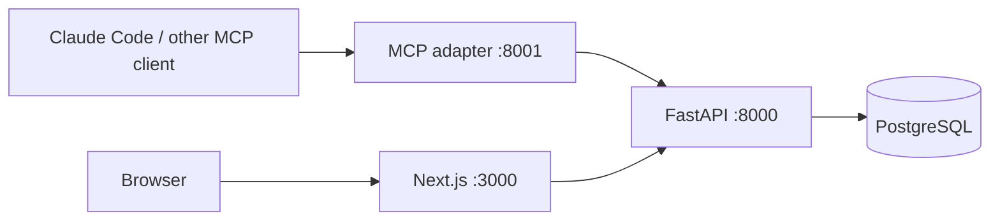

# Mnemonic MVP architecture

This decision implements the owner's revised standalone-application scope. The
original [`ADR.md`](../ADR.md) remains the historical proposal; its memory-store,
hook, embedding-cache, and host integration decisions do not apply here.

## Product contract

Mnemonic is a durable home for complete, agent-authored hand-off prompts. A
prompt is enough context for a fresh session to investigate and continue work;
it is not a ticket or an implicit instruction from the owner. Capture includes
context, the intended outcome, durable references, known hazards, and concrete
verification steps. Agent skills enforce this writing discipline. The service
stores text without silently rewriting it or pretending to verify its content.

Projects partition the store. Originating client and session ID are required;
model, branch, verified commit, tags, and extensible JSON metadata travel with
the prompt. Session IDs are opaque strings, not integers: clients often use
UUIDs or other identifiers. An agent must not invent an originating session ID.

## Services and trust boundaries

- PostgreSQL is the only durable application store, on a named Docker volume.
- FastAPI owns validation, project isolation, lifecycle, search, and persistence.
- The MCP service calls the REST API over HTTP; it has no database credentials,
  SQL, or duplicate storage logic. It supports Streamable HTTP and stdio.
- Next.js provides a project selector, search and status filters, full prompt
  viewing, editing, deleting, and copy. Its same-origin server proxy holds the
  API key; the browser never receives that key.
- All published ports bind to loopback by default. API and HTTP MCP requests
  require a shared bearer key. The dashboard is for a trusted local user, not
  a multi-user deployment. Its proxy rejects untrusted hosts and cross-origin
  requests. Remote use requires HTTPS and an authentication boundary in front
  of the dashboard. ChatGPT connectivity/OAuth is a later integration, not
  something the local MVP claims to supply.

## Retrieval and lifecycle

PostgreSQL full-text search ranks title and summary ahead of prompt content;
literal matching also finds identifiers, paths, and session IDs. This MVP does
not require embeddings, a hosted LLM, or model API keys. Search returns compact
records without the full prompt. Recall explicitly fetches one complete record.
Agents search before saving to detect possible duplicates; the database does
not automatically merge similar work.

Statuses are `open`, `done`, `wont-do`, and `promoted`. Default searches only
return `open` records. Other statuses remain available through explicit filters.
Promotion records an owner's decision; it does not create external issues.
Deletion removes a prompt from normal reads and searches, using a soft-delete
timestamp for recovery. Edits and deletes require the version that was read to
prevent one browser or agent silently overwriting another's changes.

## Durability and deliberate limits

Schema changes use Alembic migrations. Compose starts the API only after the
database is healthy, and the API runs migrations before serving. Database
backup and explicit restore procedures ship with the application. A small
additional backup container saves a checked PostgreSQL dump on startup and
daily into a private host directory; it does not delete historical dumps.
A persistent volume is not a backup: operators must monitor backup health and
copy dumps off the machine, and manage retention to avoid filling the disk.

There are no assignees, dependencies, due dates, issue synchronization, automatic
execution, memory hooks, semantic embeddings, or claims of verified freshness.
Skills carry the provenance warning and recheck cited state before execution.
