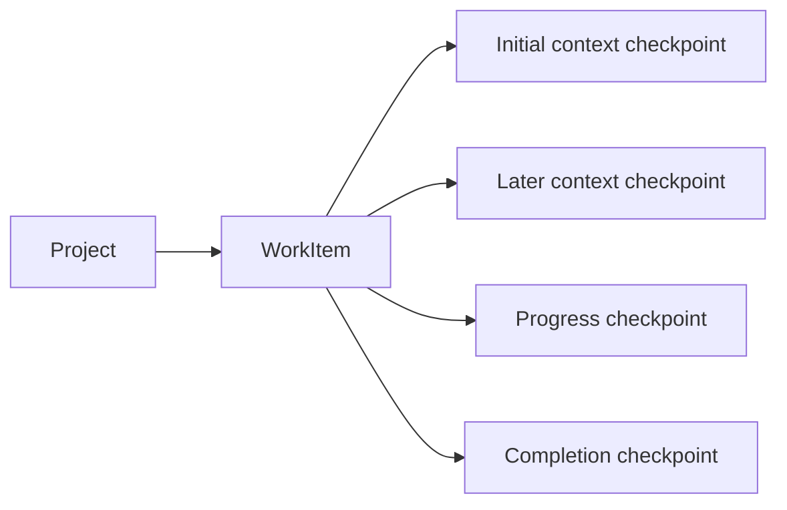
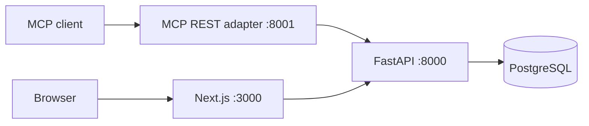

# Mnemonic Phase 1 architecture

This architecture implements Phase 1 of the product roadmap. The original
[`ADR.md`](../ADR.md) remains historical context; its memory-store and hook
proposal is not the implementation described here. The longer-term direction and
the boundaries of later phases are in [`roadmap.md`](roadmap.md).

## Product model

Mnemonic is a coordination system for temporary agents. The durable object is a
`WorkItem`: one objective that survives across sessions. A `Checkpoint` is an
immutable, session-attributed context packet appended by one of those sessions.
Ten sessions continuing one objective therefore produce one human-visible work
item and a checkpoint history, not ten top-level hand-offs.

A work item owns only mutable identity and lifecycle: title, summary, status,
priority, version, and timestamps. Checkpoints own exact prompt text, source
client/session/model, optional session URL and repository provenance, tags,
metadata, kind, and creation time.

The persisted lifecycle values remain `open`, `done`, `wont-do`, and
`promoted`. `ready` is a derived Phase 1 display fact for open work; it is
not another stored status. Completion is the only operation that can set
`done`, and it atomically appends a completion checkpoint. Reopening leaves
that historical completion checkpoint intact.

## Invariants

- New work and its initial `context` checkpoint commit in one transaction.
- Checkpoint text and provenance never change. The database rejects direct
  checkpoint `UPDATE` and `DELETE` statements as well as the API exposing no
  such routes. Corrections are new `context` checkpoints.
- Appending a checkpoint updates work activity but does not increment the work
  version. Independent appenders do not contend through optimistic versioning.
- Work edits, completion, and soft deletion require the version last read.
- Soft-deleted work and all of its checkpoints disappear from ordinary reads,
  searches, and compatibility projections.
- Every lookup is project-scoped. A work or checkpoint UUID under the wrong
  project returns 404.
- Stored prompt text and metadata are untrusted historical context. Reading or
  recalling them is not authority to execute them.
- PostgreSQL and the FastAPI service are the sole persistence and transaction
  authority. The MCP adapter never connects to the database.

## Services and trust boundaries

FastAPI owns validation, lifecycle transitions, project isolation, search,
context assembly, compatibility projections, and commits. Service functions
receive one SQLAlchemy session; reusable helpers do not commit. Routes translate
typed application errors into a stable sanitized `detail.code` envelope.

The MCP service is a typed HTTP adapter. Canonical tools use work/checkpoint
terminology; deprecated hand-off tools continue to project the same canonical
rows. The dashboard calls only an exact same-origin proxy allowlist. Its API key
is server-only, and browser request bodies containing a future `lease_token`
are rejected rather than forwarded.

All published ports bind to loopback by default. The shared bearer key protects
REST and MCP, while the dashboard remains a trusted-local single-user surface.
Remote exposure still requires HTTPS and a separate authentication boundary.

## Persistence and migration

Phase 1 adds:

- `work_items`, including an explicit `initial_checkpoint_id`;
- `checkpoints`, with generated full-text search and migration provenance;
- `work_item_embeddings`, disposable derived semantic-search state.

The initial checkpoint relationship is a deferred composite foreign key, so a
work item and its required checkpoint can be inserted atomically without a
nullable intermediate state. Generated vectors and GIN indexes keep lexical
search in PostgreSQL. Derived embedding rows can always be discarded and
rebuilt from canonical work/checkpoint content.

Migration `0004_work_graph_expand` creates the canonical schema without
touching legacy rows. Quiesced cutover migration
`0005_work_graph_backfill` copies every hand-off, soft-deleted rows included,
and maps its current prompt to an initial checkpoint. Legacy comments become
`progress` checkpoints and work summaries become `completion` checkpoints.
Exact text, timestamps, lifecycle, versions, JSONB structure, and recorded
provenance are preserved. Hand-off UUIDs remain work-item UUIDs; collision-free
comment UUIDs are preserved, while deterministic collision remaps retain the
original UUID in `legacy_record_id`.

The Phase 1 migration head intentionally retains the old tables as read-only
during an observation window. Canonical and compatibility APIs use only the new
tables. Dropping legacy tables is a later explicit contract deployment after
parity checks, a backup/restore drill, and operator approval; it is not silently
performed by this cutover image.

## Recall and retrieval

`recall_work` is deliberately bounded. It returns the work identity, initial
checkpoint, newest `context` checkpoint, and at most five additional recent
checkpoints by default. Materialized checkpoint IDs are de-duplicated, and the
response reports both total and omitted counts. Full history is available only
through deterministic checkpoint pagination.

Search returns one compact `WorkSummary` per work item, even when several
checkpoints match. It never includes prompt bodies or source metadata. Title and
summary carry the strongest lexical weight; checkpoint text and literal
identifiers/provenance/tags participate without multiplying result rows.
Canonical source and tag filters match any checkpoint.

Lexical PostgreSQL search remains the default. Opt-in semantic search embeds a
bounded composition of work identity, initial context, and recent checkpoint
text using the offline local model. The cache is keyed by work item and its
digest changes after either a work identity edit or checkpoint append. Hybrid
search preserves the established candidate-total semantics and never becomes a
work scheduler.

## Compatibility window

Legacy hand-off REST routes, MCP tools, resource URIs, and the
`resume_handoff` prompt remain available and are marked deprecated:

- saving a hand-off creates work plus its initial checkpoint;
- recalling a hand-off flattens work identity with the preserved initial
  checkpoint;
- later checkpoints project through the legacy comments timeline;
- adding a comment creates a progress checkpoint;
- completing a hand-off creates a completion checkpoint and completes work;
- legacy edits may change work fields but cannot rewrite checkpoint content or
  provenance.

The migrated initial snapshot carries an explicit warning because the former
schema could retain the original source session while allowing later prompt
edits. Mnemonic preserves the recorded values but does not fabricate authorship
history that never existed.

## Deliberate Phase 1 limits

Phase 1 does not add leases, claims, ready-work scheduling, typed relationships,
hierarchies, human gates, merge behavior, repository verification, or automatic
execution. Response readiness fields are safe derivations from lifecycle only,
and relationship collections are empty extension points. Those later concepts
must not be inferred from checkpoint prose or implemented as hidden Phase 1
workflow state.

Backups include canonical work and checkpoint history. Operators must still copy
backups off-machine and rehearse restores; a persistent Docker volume is not a
backup.
