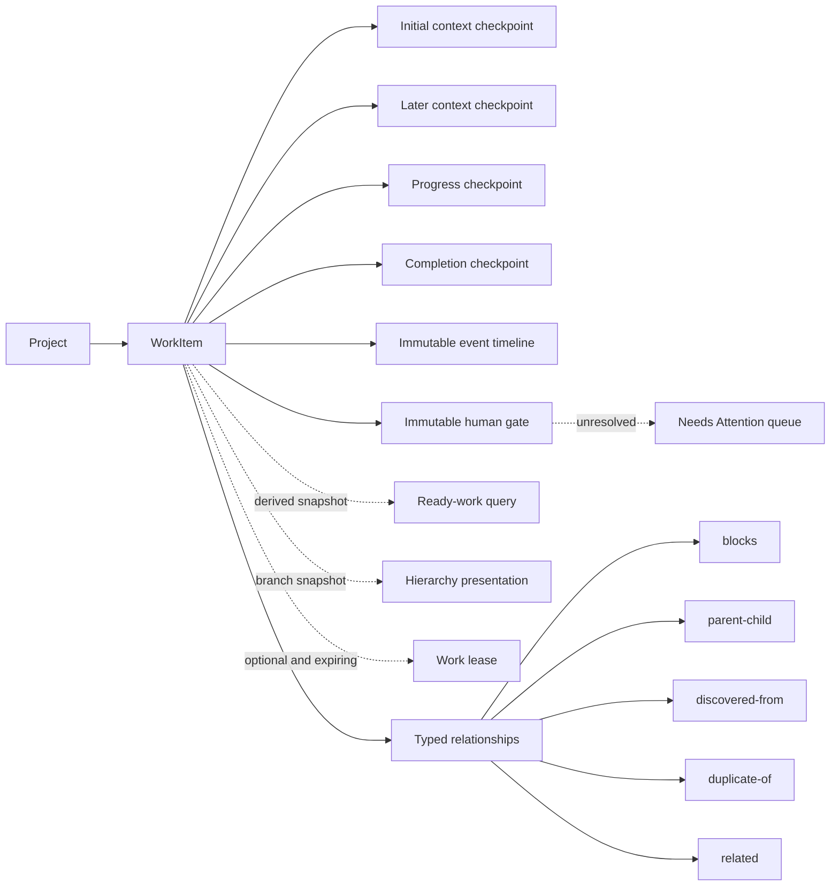
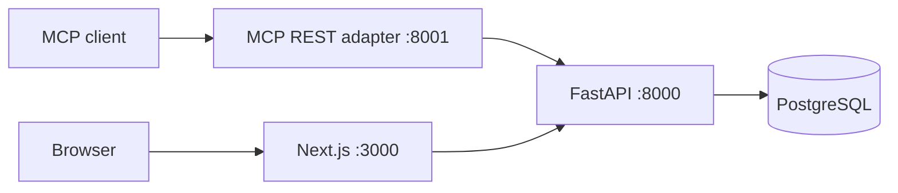

# Mnemonic Phases 7–8 architecture

This architecture describes the implementation through Phases 7–8. The longer-term
direction and the boundaries of later phases are in [`roadmap.md`](roadmap.md).

## Product model

Mnemonic is a coordination system for temporary agents. The durable object is a
`WorkItem`: one objective that survives across sessions. A `Checkpoint` is an
immutable, session-attributed context packet appended by one of those sessions.
Ten sessions continuing one objective therefore produce one human-visible work
item and a checkpoint history, not ten top-level records.

A work item owns only mutable identity and lifecycle: title, summary, status,
priority, version, and timestamps. Checkpoints own exact prompt text, source
client/session/model, optional session URL and repository provenance, tags,
metadata, kind, and creation time.

A `WorkEvent` is a concise immutable fact in one work item's history. It can
reference a checkpoint, lease generation/release action, or complete
relationship snapshot without copying checkpoint text or capability-bearing
request fields. Server-reserved events are constructed only by the mutation
that proves them. Clients can append only bounded `progress`; that does not
replace resume context and does not increment the work version.

The live `WorkItem` lifecycle values are `pending`, `deferred`, `done`,
`wont-do`, and `promoted`; current work-item responses never return `open`.
Historical `WorkEvent` snapshots may retain legacy `open`, while new events use
Pending/Deferred values. Pending means no session has started or work remains
incomplete; Deferred is an intentional human-controlled hold outside the agent queue.
`active`, `dropped`, `blocked`, and `waiting` are derived facts. Active means an
unexpired lease exists; Dropped means the retained lease expired unexpectedly;
Waiting means at least one unresolved human gate exists. Pending, visible work
is ready only when it has no unexpired lease, unresolved incoming `blocks` edge,
or unresolved human gate. Only a blocker whose source is `done` is resolved;
`wont-do` and `promoted` do not imply completion. A work item can be active,
blocked, and waiting simultaneously because later facts do not revoke an
existing lease. Waiting has display precedence, but the independent flags
remain authoritative. Completion is the only operation that can set `done`, and it
atomically appends a completion checkpoint. Reopening leaves that historical
completion checkpoint intact.

Ready discovery runs the same nonrecursive blocker/lease/gate predicate used by
a fresh or replacement claim and returns only compact pointers. Its order is `priority DESC,
created_at ASC, id ASC`; tag and direct-parent filters do not change
eligibility. A page is one statement snapshot, not a reservation. Concurrent
changes can shift offset pages, and `claim_and_recall` remains the authority
that locks and revalidates before already-authorized execution.

## Invariants

- New work and its initial `context` checkpoint commit in one transaction.
- Up to ten initial relationships may commit in that same transaction. A
  failed edge leaves neither partial work nor partial graph state.
- Relationship endpoints are project-local and use `source --type--> target`.
  `related` endpoints are normalized; `blocks` and `parent-child` cycles are
  rejected, and each child has at most one parent.
- Graph mutations serialize on the project row and then lock endpoint work in
  UUID order so concurrent cycle checks cannot both commit reciprocal edges.
- Only unresolved incoming `blocks` edges and unresolved human gates affect
  readiness and fresh/replacement claimability. Existing leases survive either
  later fact; exact active claim replay, renewal, and release remain available.
- A gate request freezes the work version, newest context-checkpoint ID, and
  relationship-event count; the gate and exact `human_attention_requested` event
  commit atomically. Resolution is one immutable transition with an exact
  `human_attention_resolved` event and a reviewed current revision. Stable
  request-known controls are rejected before receipt reservation; replay and
  conflict return before a genuinely new execution checks currently retained
  gate/operation UUIDs and rolls back a rejected reservation. This finite lookup
  is not a universal secret detector or a dependency of permanent replay.
- An unresolved gate rejects completion, terminal transitions, and deletion at
  both the service and PostgreSQL layers. Identity edits, deferral/Pending
  restoration, checkpoints, progress, and relationship changes remain possible.
- A work mutation and every authoritative event it proves share one transaction.
  Claim/relationship replay, absent removal/release, and renewal emit nothing.
- A protected mutation's project-scoped receipt, domain changes, and events
  share that transaction. A committed receipt is immutable and replays its
  validated original status/body before current resource visibility or lifecycle
  checks; a rolled-back attempt leaves no receipt.
- At most one receipt exists for a `(project_id, client_operation_id)`. Its
  salted fingerprint binds operation kind, path target, actor, version,
  capability, and normalized semantic body. A mismatch fails closed rather than
  executing a second intent.
- Event rows are immutable through both the route surface and PostgreSQL
  `UPDATE`/`DELETE` trigger. Per-work order is `created_at, id`; the identity is
  a tie-breaker, not a project activity cursor or commit-order promise.
- Event actor fields are asserted client provenance. They are never inferred
  from the bearer credential, transport, retained lease holder, relationship
  creator, or dashboard label. Older direct REST writes that omit a newly
  optional actor are stored honestly as `unattributed`.
- Server-reserved constructors do not accept bearer, lease-token, or claim-ID
  fields. Public progress rejects request-known credential/capability echoes,
  but accepted opaque text may still contain sensitive material the service
  cannot recognize and returns exactly to authorized history readers.
- Work with any relationship cannot be soft-deleted until its edges are
  removed, and work with any unresolved gate cannot be soft-deleted or moved
  terminal. Relationship context is supporting historical evidence; it never
  grants authority to follow or execute the linked work.
- Checkpoint text and provenance never change. The database rejects direct
  checkpoint `UPDATE` and `DELETE` statements as well as the API exposing no
  such routes. Corrections are new `context` checkpoints.
- Appending a checkpoint updates work activity but does not increment the work
  version. Independent appenders do not contend through optimistic versioning.
- Work edits, completion, and soft deletion require the version last read.
- At most one retained lease row exists per work item. PostgreSQL row locks and
  database time arbitrate acquisition, replay, renewal, expiry, and replacement.
- The server chooses lease duration. A client-generated `claim_request_id`
  recovers the same active claim receipt after an unknown outcome without
  extending it; it is not general mutation idempotency.
- A lease token is a capability for renewal, release, and terminal lifecycle
  mutation while the lease is active. It appears only in lease receipts and
  JSON request bodies, never ordinary reads, errors, URLs, or browser data.
- Lease operations never change work version or activity time. Checkpoint
  append remains open because it records an observation rather than ownership.
- Completion, retirement, promotion, and deletion require the matching token
  when an active lease exists and remove that lease in the same transaction.
- Soft-deleted work and all of its checkpoints disappear from ordinary reads
  and searches. Its immutable gate history remains readable only through an
  exact project/work ID for retained audit and receipt replay.
- Every lookup is project-scoped. A work or checkpoint UUID under the wrong
  project returns 404.
- Stored prompt text and metadata are untrusted historical context. Reading or
  recalling them is not authority to execute them.
- PostgreSQL and the FastAPI service are the sole persistence and transaction
  authority. The MCP adapter never connects to the database.
- `client_operation_id` is private control data. It is accepted only at the
  top level of the twelve enrolled REST request bodies, never persisted in domain
  models/events or returned through public read surfaces.

## Services and trust boundaries

FastAPI owns validation, lifecycle transitions, project isolation, search,
the reusable readiness predicate/query, relationship invariants, immutable
event and human-gate construction/listing, attention cursors, bounded context,
hierarchy presentation queries, idempotency
receipt reservation/replay, and commits. Service functions receive one
SQLAlchemy session; reusable helpers do not commit. The closed operation
registry is the only path that can canonicalize, reserve, validate a stored
response, or complete a receipt. Routes translate typed application errors into
a stable sanitized `detail.code` envelope.

The MCP service is a typed HTTP adapter. Its ten protected mutation tools
require the caller to prepare and retain one operation UUID plus the complete
arguments; the adapter sends only one HTTP attempt. Its other tools use work,
checkpoint, lease, relationship, and human-gate terminology. Its exact 25-tool
catalog includes request, attention, and gate-history operations but deliberately
no resolution tool. The dashboard calls only an exact same-origin proxy
allowlist, including attention/history reads, gate resolution, event
list/progress append, and actor-bearing work or relationship writes. A dashboard-lifetime in-memory
registry owns frozen protected intents, blocks overlapping conflicts while an
outcome is unresolved, and never writes those bodies or UUIDs to browser
storage. Its API key is server-only. Every lease-capability route
is denied to the browser, event append rejects a browser lease token, and any
browser mutation body containing `lease_token` is rejected rather than forwarded.

All published ports bind to loopback by default. The shared bearer key protects
REST and MCP, while the dashboard remains a trusted-local single-user surface.
Remote exposure still requires HTTPS and a separate authentication boundary.
Requester and resolver provenance is asserted under that shared bearer; it is
not authenticated human identity, an approval signature, or independent
verification of an answer.

## Persistence and migration

Phase 1 adds:

- `work_items`, including an explicit `initial_checkpoint_id`;
- `checkpoints`, with generated full-text search and migration provenance;
- `work_item_embeddings`, disposable derived semantic-search state.

The initial checkpoint relationship is a deferred composite foreign key, so a
work item and its required checkpoint can be inserted atomically without a
nullable intermediate state. Generated vectors and GIN indexes keep lexical
search in PostgreSQL. Derived embedding rows can always be discarded and
rebuilt from canonical work/checkpoint content.

Migration `0004_work_graph_expand` creates the canonical schema without
touching legacy rows. Quiesced cutover migration
`0005_work_graph_backfill` copies every hand-off, soft-deleted rows included,
and maps its current prompt to an initial checkpoint. Legacy comments become
`progress` checkpoints and work summaries become `completion` checkpoints.
Exact text, timestamps, lifecycle, versions, JSONB structure, and recorded
provenance are preserved. Hand-off UUIDs remain work-item UUIDs; collision-free
comment UUIDs are preserved, while deterministic collision remaps retain the
original UUID in `legacy_record_id`.

The Phase 1 migration head retained the old tables as read-only during an
observation window. After the required parity checks, backup/restore drill,
observation window, and explicit operator approval,
`0006_work_graph_contract` removed the legacy tables and their unused ORM
metadata. Every API and MCP surface reads the canonical tables.

The migrated initial snapshot carries an explicit warning because the former
schema could retain the original source session while allowing later prompt
edits. Mnemonic preserves the recorded values but does not fabricate authorship
history that never existed.

Phase 2 migration `0007_work_leases` adds one optional `work_leases` row per
work item, bounded holder/request fields, acquisition/renewal/expiry ordering
constraints, and an expiry index for diagnostics. Expired rows may remain;
correctness never depends on a cleanup worker.

Phase 3 migration `0008_work_relationships` adds project-local typed graph
edges, composite endpoint and checkpoint foreign keys, normalized natural
identity, a one-parent partial unique index, and source/target lookup indexes.
Database checks enforce different endpoints, paired context fields,
endpoint-owned context, required target context for `discovered-from`, and UUID
ordering for `related`. The service adds serialized cycle checks and
transactional initial-link creation; the migration does not infer graph facts
from checkpoint prose.

Phase 4 migration `0009_ready_work_indexes` adds the partial
`ix_work_items_ready_order` index and an immutable normalized-tag SQL function
with a matching GIN expression index. Readiness remains derived; there is no
queue table, persisted ready flag, scheduler, or background refresh process.

Phase 5 migration `0010_work_events` assigns a nonsecret generation UUID to
every retained lease, adds the transaction-only release marker, and creates
`work_events`. Typed checkpoint, lease, and complete relationship references,
event-specific metadata checks, source-fact/deferred-state guards, unique fact
indexes, and an immutability trigger keep stored history tied to its retained
domain fact. Removal/release events retain action IDs after their mutable edge
or lease row is gone; retained work/checkpoint endpoints remain foreign keyed.

The migration reconstructs only provable facts: creation, later checkpoints,
completion checkpoints, retained relationships and leases, and soft deletion.
Every reconstructed row has `origin=backfill`; later updates, reopenings,
releases, removals, and expired/replaced leases are not invented. A complete
stable candidate sort precedes identity allocation. Ordinary reads hide event
history after soft deletion, while the rows remain available to operator
audit.

Migration `0011_project_settings` adds the optional per-project recall pointer
template. Migration `0012_pending_deferred_statuses` then introduces the
Pending/Deferred lifecycle split. Phase 6 therefore uses
`0013_idempotent_mutations` on the final integrated history.

`0013_idempotent_mutations` adds the private `client_operations` ledger with
exact project/UUID uniqueness, versioned salted SHA-256 request fingerprints,
bounded JSON response receipts, and pending/completed invariants. It
intentionally has no project or resource foreign keys: replay must survive
soft deletion and avoiding those foreign-key locks preserves the established
project-first graph lock order. Insert/update/delete and deferred-completion
triggers allow only a pending insert followed by one completion in the same
transaction; pending rows cannot commit, and completed rows cannot change or
be deleted.

The same migration adds a separate recursive
`client_operation_id` progress-metadata check as `NOT VALID`. Historical
metadata remains readable and unchanged, while every new or updated progress
row must satisfy the Phase 6 reservation. The Phase 5 metadata-v1 validator is
not rewritten.

`0014_human_gates` creates `work_gates` with project/work scope, immutable
request and resolution provenance, request/current/resolved revision anchors,
and an identity-backed attention sequence. It adds the internal nullable
gate reference to `work_events`, typed request/resolution metadata, exact-event
uniqueness, and source-fact checks. Deferred completeness triggers require an
unresolved gate plus request event at commit and require the single resolution
transition plus resolution event together. Gate/event updates, unresolution,
and deletion fail closed.

The migration widens the private receipt registry to exactly twelve kinds and
preserves every existing work, event, metadata value, and completed receipt. A
separate `NOT VALID` check reserves top-level gate metadata on new non-gate
events without retroactively invalidating historically legal progress metadata.
The request schema recursively rejects case-insensitive `gate_id` and
`gate_type` progress metadata before receipt reservation, while the response
metadata model remains permissive enough to read preserved historical rows.
Lease and work triggers prevent a stale application from inserting/replacing a
lease or committing terminal/delete state while a gate is unresolved; same-
generation renewal/release remains possible. Downgrade takes writer locks and
succeeds only before any gate, gate event, or gate-operation receipt exists.

The API setting `MNEMONIC_HUMAN_GATE_REQUESTS_ENABLED` defaults false and is
checked only on genuinely new requests after receipt replay. This permits a
coordinated mixed-deployment cutover: all enforcement, reads, and resolution are
active at migration head while supported clients are upgraded before request
creation is enabled.

## Idempotent mutation execution

The twelve enrolled REST operations are create work, add checkpoint, append
event, add relationship, update, defer, complete, delete, remove relationship,
release claim, request human input, and resolve human input. Direct REST makes
the operation UUID optional. Canonical MCP requires it for ten tools: the
previous nine plus gate request; defer and gate resolution remain human control
plane actions without MCP tools. The browser keys its ten non-capability
mutations: the previous nine plus resolution, while gate creation and release
remain proxy-denied. Project administration, claim, claim-and-recall, and
renewal are explicitly excluded.

For a keyed request the service validates secrets and canonicalizes the entire
semantic envelope before any domain lookup. Defaults and nulls are explicit,
JSON object keys are sorted, initial relationship order is normalized, and
undirected `related` endpoints are normalized. It inserts the pending receipt
first. A conflicting in-flight insert waits for at most
`MNEMONIC_CLIENT_OPERATION_WAIT_SECONDS`; after the owner commits, an exact
waiter validates and returns the stored response. Timeout or an unverifiable
receipt fails closed. Fresh execution then uses the pre-existing domain lock
order and completes the receipt before the route's sole commit.

Live synchronization carries only `{type, revision, scope}` control fields;
there is no project, work, gate, receipt, count, or content identifier in a
frame. The dashboard conservatively refreshes its selected scope. A first execution
publishes only when it applied domain work; a natural no-op publishes nothing.
An exact replay republishes the data-free invalidation only when the stored
`mutation_applied` was true, healing a browser that lost the first response.
The receipt itself has no public endpoint, TTL, cleanup job, or resource foreign
key.

## Recall and retrieval

`recall_work` is deliberately bounded. It returns the work identity, initial
checkpoint, newest `context` checkpoint, and at most five additional recent
checkpoints by default. If the initial checkpoint is still current,
`current_context` is null and `current_context_is_initial` directs clients to
the single materialized initial body. It also returns ten recent events by
default, chronologically, with a maximum of 20. Checkpoint and event totals,
omission counts, and the backfill-based partial-history flag describe the whole
history independently of the returned slice. Full history requires explicit
checkpoint or event pagination. Context also includes bounded unresolved and
recent-resolved gate slices with exact totals/omitted counts; focused human
review can require a named unresolved gate in the one-snapshot response, while
complete paired decisions use cursor-paged gate history.

Ordinary recall and search return only the safe active-lease projection: holder
client/session and acquisition, renewal, and expiry timestamps. The request ID
and token are excluded. `claim_and_recall` acquires or replays a claim and
assembles the same bounded context before one commit. Recall includes immediate
incoming, outgoing, and undirected relationships with counts and pointer-only
counterparts; it never recursively injects the graph. Ordinary recall caps each
relationship direction at 50. The exact nested review route for a valid unresolved gate deliberately
materializes every adjacent edge in that same statement so the dashboard can
fail closed unless the human review is complete; its payload and counterpart
projection cost scale with focal degree. Context assembly is one SQL statement
so a `READ COMMITTED` request does not mix multiple snapshots.

Search returns one compact `WorkSummary` per work item, even when several
checkpoints match. It never includes prompt bodies or source metadata. Title and
summary carry the strongest lexical weight; checkpoint text and literal
identifiers/provenance/tags participate without multiplying result rows.
Canonical source and tag filters match any checkpoint.

Lexical PostgreSQL search remains the default. Opt-in semantic search embeds a
bounded composition of work identity, initial context, and recent checkpoint
text using the offline local model. The cache is keyed by work item and its
digest changes after either a work identity edit or checkpoint append. Hybrid
search preserves the established candidate-total semantics and never becomes a
work scheduler.

## Hierarchical human presentation

Root and child hierarchy pages are a human presentation over the unchanged
project-local graph. The dashboard collapses descendants by default and lazily
loads direct children, while each `HierarchySummary` carries one-statement
branch aggregates: direct children; strict descendants; blocked, active,
completed, and discovered descendants; inclusive unresolved human gates;
discovery labels for the current node; and the earliest active descendant lease
expiry. Counts are independent rather than mutually exclusive, so one
descendant may be active, blocked, and gated.

Lifecycle/source/tag filters are subtree-aware. A root or direct branch is
retained when it or any descendant matches; `self_matches_filter` and
`has_matching_descendants` explain when a muted ancestor is only navigation
scaffolding. Root totals count qualifying roots, direct-child totals count
qualifying branch children, and the presentation counts remain unfiltered
facts about the complete branch. The service computes the page, total,
aggregates, filter flags, and database-time lease state in one PostgreSQL
statement rather than a Python walk or per-branch query.

A nonblank query uses flat search and returns a bounded root-to-parent breadcrumb
plus `ancestor_path_truncated` on the direct `WorkSummary` hit. Planned children
and `discovered-from` work have distinct presentation labels; discovered work
without that parent relationship remains a top-level root. The renderer applies
explicit cycle and depth fallbacks instead of silently hiding corrupt or
unexpectedly deep branches, and schedules passive refresh from the earliest
visible descendant lease expiry.

## Deliberate Phases 7–8 limits

Ready discovery is not automatic scheduling and there is no
`claim_next_ready_work`. The receipt ledger still excludes project
administration, claim, claim-and-recall, and time-anchored renewal. Human gates
support only the `human` type: no timers, CI/external-event gates, automatic
expiry, escalation, notification delivery, authenticated approval signatures,
or agent-facing resolution operation exists. A stored question/answer is
untrusted context under a shared bearer, not verified human identity or renewed
execution authority.

The release does not add duplicate merging, repository freshness verification,
resource reservation, or automatic execution. `duplicate-of`, `related`,
`parent-child`, and `discovered-from` remain descriptive; only `blocks` and
unresolved gates change readiness, for different reasons. No relationship or
human answer may be inferred from search similarity or checkpoint prose.

The per-work event identity is not a durable project activity cursor. The gate
attention cursor is purpose-built from immutable request sequence and identity;
it does not create a general `get_activity`, notification broker, SSE/webhook
feed, or passive lease-expiry event.

Backups include canonical work, checkpoints, leases, relationships, immutable
events and their sequence, human gates and attention sequence, durable
client-operation receipts, and migration state. Operators must still copy
backups off-machine and rehearse restores; a persistent Docker volume is not a
backup.
