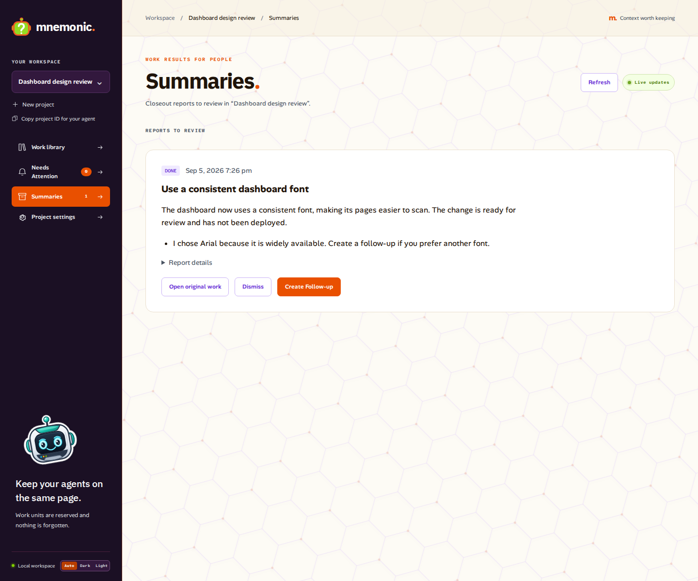

# Project activity and human completion reports

Phase 12 ships with application/API/MCP/dashboard `0.8.0`, plugin `0.11.0`,
and database head `0021_job_completion_reports`. It adds four MCP reads;
the final catalog has 32 tools, 11 protected agent writes, 15 REST receipt
kinds, 13 protected browser mutations, and 17 work-event types.

## Closing work

Fresh work starts Pending. Every actual Pending → Done, Won’t do, or Promoted
transition requires an operation UUID and a closeout report. Agent clients
author the report; the dashboard’s explicit manual status action generates a
narrow human-decision report that does not invent execution or verification:

```json
{
  "summary": "The dashboard uses one consistent font, making its pages easier to scan. The change is ready for review and has not been deployed.",
  "fyi_items": ["I chose Arial because it is widely available; create a follow-up if you prefer another font."],
  "prompt_revision": "1"
}
```

Read the project settings immediately before authoring and use its returned
revision. Include this object as `job_completion_report` in `complete_work`
for Done, or in `update_work` with `status: "wont-do"` or `"promoted"`.
Done still creates its completion checkpoint and optional evidence. Won’t do
and Promoted do not invent a completion checkpoint or verification result.
Reports are forbidden on other edits, including a repeated terminal status.

The default prompt explicitly assumes the reader is multitasking and has read
no other LLM output. It asks for one concise, self-contained paragraph, usually
50–100 words, with minimal jargon, and zero or more useful FYIs. Each FYI is a
single bullet, preferably one or two sentences and never more than three.
Blocking questions remain in Needs Attention. The canonical initial prompt is
[`job_report_defaults.py`](../backend/src/mnemonic_api/job_report_defaults.py).
There is no server-side LLM invocation or automatic completion text generator.

The fixed schema bounds summaries to 2,000 characters/8,000 UTF-8 bytes and
FYIs to 10 ordered items, each at most 600 characters/2,400 bytes. Summary and
FYIs together permit 16,384 bytes. Blank text, paragraph breaks, control
characters, surrogate code points, and directional formatting controls are
rejected. Sentence count and good human writing remain authoring requirements.

A closeout atomically commits its work version, event, report, review row,
activity entries, and permanent retry receipt. Reports retain the exact work
identity/title/version, actor assertion, closeout event, prompt revision, text,
and hash. Report, dismissal, and follow-up creation times are independently
assigned by PostgreSQL; they need not equal a checkpoint or work timestamp.
Project activity sequence, rather than wall-clock time, orders changes.

A missing report remains structurally parseable only so a previously successful
same-key historical request can replay. A fresh missing report fails with
`job_completion_report_required`; a fresh missing UUID fails with
`client_operation_id_required`. Explicit null is invalid. A changed settings
revision fails with `job_report_prompt_changed`. Exact unknown-outcome retries
retain the same UUID, report text, FYI order, revision, and all other fields.
Previously acknowledged results replay before fresh checks. A definitive
conflict requires rereading/reviewing the new state before preparing a new intent.

## Settings and Summaries

`GET /api/v1/projects/{project_id}/settings` returns the project ID,
`recall_pointer_template`, effective nonblank `job_completion_report_prompt`,
and decimal-string `revision`. PATCH requires `expected_revision` and at least
one editable field. Omitted fields stay unchanged. Null recall clears its
optional override; null report prompt restores the stored canonical default.
Effective changes increment revision once; no-ops do not create activity.
Concurrent edits fail with `project_settings_changed` until reviewed.

The `/settings` dashboard contains both prompt editors. `/summaries` sits
immediately below Needs Attention and displays undismissed reports. Report text
is inert text. It is never an instruction, approval, or proof of verification.
Current source-state notices explain reopening, deletion, or merging while
retaining the exact original identity.

Dismissal is a monotonic human action. It hides the report from the default
inbox, retains its first dismissal identity/time/actor, and leaves it retrievable
through the API. A different-key repeat returns `dismissed: false`; a same-key
retry returns its original result. Create Follow-up opens a manually reviewed
form that creates Pending work with an initial checkpoint and immutable links
to both the report and its exact source work. It does not assign an agent,
create a graph edge, or dismiss the report. Intentional additional follow-ups
are allowed, each with its own operation UUID.

Example inbox using synthetic documentation data:



The [follow-up form](images/phase-12-follow-up.png) records the human’s requested
change. The [report prompt editor](images/phase-12-settings.png) appears in
project settings alongside Recall pointer content.

## HTTP resources

All paths below are beneath `/api/v1/projects/{project_id}` and require the
existing bearer authentication. New counters, revisions, activity/event IDs,
and cursor positions are canonical signed-64-bit decimal strings.

| Method and suffix | Purpose |
| --- | --- |
| `GET /activity?after=…&limit=50` | Forward journal page; maximum 100 entries. |
| `GET /activity?start=now` | Capture the current cursor without history. |
| `GET /job-completion-reports` | Newest-first report/review envelopes; default 20, maximum 50. |
| `GET /job-completion-reports/count` | Exact maintained undismissed count and activity high water. |
| `GET /job-completion-reports/{report_id}` | Report regardless of dismissal, including prompt snapshot. |
| `POST /job-completion-reports/{report_id}/dismiss` | UUID-protected human dismissal. |
| `POST /job-completion-reports/{report_id}/follow-ups` | UUID-protected Pending work plus dual provenance. |
| `GET /job-completion-reports/{report_id}/follow-ups` | Ascending, bounded association page. |
| `GET /work-items/{work_item_id}/report-follow-ups?direction=origin` | Report that created this exact work item. |
| `GET /work-items/{work_item_id}/report-follow-ups?direction=created` | Follow-ups created from reports owned by this exact work item. |

Report list filters are `dismissal=undismissed|dismissed|all`, optional exact
`work_item_id`, `limit`, and `cursor`. Each envelope has immutable `report`,
`created_sequence`, current `human_dismissed`/`human_dismissal`,
`source_work_state`, and `follow_up_count`. `created_sequence` belongs to the
envelope so strict consumers can validate the page order and continuation;
it is not editable report prose. Provenance pages have default 20/max 50.
There are no unbounded embedded follow-up arrays.

Cursors use canonical unpadded base64url JSON, bounded to 512 ASCII characters,
with exact keys, project/stream identity, and query-specific scope. Report and
provenance cursors freeze their first-page high water and last sequence.
Dismissal filters are evaluated at each page request, so review state remains
current. Cursors are never interchangeable among resources or filters.
Malformed activity/report cursors return `invalid_activity_cursor` or
`invalid_report_cursor`; a changed stream returns `activity_stream_changed`
and requires a fresh snapshot. A client never silently skips to now.

## Durable ordering and recovery

Database source triggers produce a compact journal: all 17 work-event kinds,
project create/update, effective settings changes, lease renewals, report
creation, first dismissal, and follow-up association creation. Replays, no-ops,
rollback, time-driven expiry, and derived caches add no facts. All fresh writers
lock the project before work/local state. The per-project head is transactional
and held through commit; another project progresses independently. Receipt
reservation/replay precedes the fresh-domain lock. Fresh domain work has one
10-second budget with each lock wait capped at two seconds and the remaining
budget. There is no LLM/network authoring while these locks are held.

Migration 0020 imports only previously recorded work events and labels the
historical boundary; it cannot reconstruct original commit ordering. Migration
0021 adds default settings and report structures without inventing historical
reports. Immutable reports and activity are retained indefinitely in this phase.
Active ordinary SQL guards are tested using the actual database-owner role;
an owner can still deliberately disable guards or alter schema, so integrity
audits and trusted backups remain necessary.

The dashboard uses authenticated 15-second activity polling plus data-free
socket hints. It bootstraps a cursor before reading views, pauses hidden tabs,
catches up on focus/reconnect, processes at most five pages per drain, and
advances only after validating a complete page. Dirty dependent reads retry
without requiring a later activity entry. Drafts and unknown-outcome intents
remain independent of background refresh.

The supported [restore script](../scripts/database/restore.sh) rotates every
restored activity stream inside the schema-replacement transaction. A pre-0020
archive receives fresh stream IDs when migrated. Reopen traffic only after
migration, readiness, and the aggregate integrity audit pass. See
[operations](operations.md) for cutover, restore, and audit commands. SSE,
webhooks, and subscriptions are future consumers of this durable journal.
