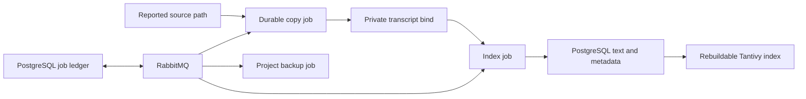

# Durable transcript copies and background jobs

Application/API/MCP/dashboard 0.52.0 uses migrations `0036_transcript_copies`
and `0037_background_jobs`. Upgrade all application processes together. The MCP
tool catalog and agent transcript assertions are unchanged.



The `worker` container is the RabbitMQ client. It consumes copying, indexing,
and project backup jobs, and serves the private dashboard backup endpoints on
port 8002. The `rabbitmq` container retains its queue on a Docker volume and has
no published host ports. The dedicated `backup` container is removed. The API
continues serving transcript searches and import discovery; it no longer runs
the transcript indexer inside its web process.

PostgreSQL retains job intent, retry timing, ownership, and results. RabbitMQ
messages contain only a version and job UUID, with confirmed persistent
publication and manual acknowledgments. The dispatcher republishes unfinished
jobs after a bounded reservation expires, including after broker data loss.
Consumers renew their job leases during blocking work. Domain generation and
lease checks reject stale publication; duplicate delivery is expected.
These choices follow RabbitMQ's [reliability guidance](https://www.rabbitmq.com/docs/reliability)
and [acknowledgment documentation](https://www.rabbitmq.com/docs/confirms).
This single-server deployment tolerates restarts, but does not provide broker
availability during host failure; queued intent remains in PostgreSQL.

## Copy and indexing behavior

The exact reported `source_path` remains provenance. A separate immutable
snapshot identity names the retained file. Copying opens only regular files
under the approved source roots, refuses symlinks, streams bounded chunks, and
checks for source changes during capture. It writes a private temporary file,
flushes it to stable storage, publishes it atomically, and records the verified
size and SHA-256. A crash before the database commit can reuse the published
snapshot. Tenacity applies bounded exponential backoff with jitter to transient
copy failures; the durable job layer handles retries across process restarts.
Policy failures such as an outside-root source are recorded explicitly.

Indexing opens the retained copy and verifies its integrity. Rebuilding an index
reuses that copy even if the client deletes, moves, or modifies its source.
Converting an imported transcript into a new agent enrollment establishes a new
capture identity so subsequent work can capture the finished session. Active
lease generations and paused projects retain their existing eligibility guards.
There is no continuous tailing.

Worker startup removes abandoned unlocked partial files older than 24 hours.
Final snapshots from superseded enrollment attempts remain retained; include this
growth in storage planning and do not delete files referenced by database snapshots.

Migration marks every existing transcript for copying, including ready and failed
records. Existing searchable text remains available until a replacement extraction
succeeds, including through copy failures and failed rebuilds. A changed legacy
source is reindexed after capture; a matching snapshot can retain its previous
extraction. Separate copy/index status and errors appear in transcript metadata, and
incomplete coverage includes uncopied records. Missing historical files cannot be
reconstructed from normalized text; recover the original bytes if available.

## Deployment and existing transcript migration

1. Build the new API, worker, MCP, and web images before stopping the old stack.
   Take a database backup with the old release and retain filesystem backups of
   artifacts and prompts. Existing backup archives retain their original schema
   signature; restore them using their matching application release.
2. Add an independent random URL-safe `MNEMONIC_RABBITMQ_PASSWORD` to the private
   `.env`. New installations receive one from `scripts/setup.py`. Do not publish
   broker credentials or ports.
3. Create `MNEMONIC_TRANSCRIPT_DIR` (default `/var/lib/mnemonic/transcripts`) as a
   private `0700` directory owned by `MNEMONIC_API_UID:MNEMONIC_API_GID`. The worker
   mounts it at `/var/lib/mnemonic/transcripts`; native workers use
   `MNEMONIC_TRANSCRIPT_ROOT`. Keep it separate from source roots and the generated
   Tantivy directory. Include the copied files in filesystem backups.
4. The worker uses the same image UID/GID as the API to read private client files.
   If this differs from the old backup service's `10001:10001`, stop the old backup
   service and migrate ownership of the exact configured backup directory and its
   existing contents. Preserve `0700` directories and `0600` files. Do not change
   source transcript permissions.
5. Stop the old API, MCP, web, and backup processes before applying the new schema.
   Start the new stack with `docker compose up --build -d --wait --remove-orphans`.
   API startup applies the migrations; the worker starts only after API, RabbitMQ,
   and Tika are healthy. Never run the old backup process against the new schema.
6. Run the content-free backfill report and checksum verification:

   ```sh
   docker compose exec -T worker python /app/scripts/migrate_transcript_copies.py --wait --verify
   ```

   Copy jobs are resumable across worker and broker restarts. The command reports
   copy/index pending and failed counts, plus active/paused counts. It waits for
   indexing too and exits nonzero if any copy/index remains incomplete or a file
   fails verification. `--timeout SECONDS` bounds waiting.
   Retain this report with the deployment record. Existing source directories must
   remain mounted for future transcript captures and folder imports.

## Backups and operation

The dashboard queues manual backups and polls the private worker for completion.
Scheduled backups use per-project time-slot identities, so restarting workers
does not create duplicate startup backups. File publication uses the job identity
to survive a crash after archive creation without duplicating retention effects.
Restore remains an explicitly confirmed synchronous operation protected by the
existing storage lock. Worker jobs are excluded from project archives.

Project archives contain transcript metadata and normalized text. Raw transcript
copies, artifact files, and prompt files remain separate filesystem backup
responsibilities. Preserve the transcript bind together with a database snapshot;
a raw-file checksum verification detects absent or damaged retained copies.

`docker compose ps` and the worker's private `/healthz` report broker/dispatcher
health. Inspect aggregate `background_jobs` status/error counts in PostgreSQL for
terminal failures. A lost broker connection immediately marks the worker unhealthy
and fences its active delivery. Reconnection waits for already-running synchronous
IO to return; an indefinitely blocked filesystem operation requires a worker
restart. The broker's dead-letter queue retains rejected malformed
messages. Logs report safe error classes/codes, never transcript contents or
credentials. Test the stack with `scripts/test-e2e.sh`; backend tests use the
isolated PostgreSQL and RabbitMQ services in `compose.test.yaml`.
