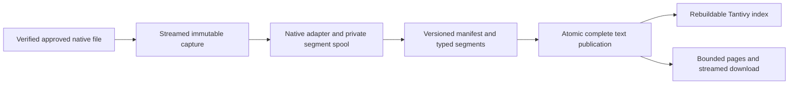

# Transcript pipeline audit — 0.65.0

The audit followed enrollment/import, immutable capture, native normalization,
canonical persistence, durable jobs, search, text retrieval/download, dashboard
controls, recovery, and backup contracts. Release 0.65.0 requires migration
`0045_transcript_capacity`; the MCP tool/write catalogs and plugin release are unchanged.

## Observed failures and corrections

A read-only installation audit on 2026-09-18 found 1,410 enrollments: 1,350 ready,
five native-size failures, two missing sources, four nonregular paths, and 49
retained files rejected as unsupported. Nineteen ready entries had limited text.
Counts describe that observation, not a promise that every source is recoverable.
A later aggregate-only capacity check found **578,621,464 bytes** of indexed text
in the largest project (1,276 ready entries), already above its configured
**536,870,912-byte** content-search budget. Across both projects, active canonical
segments contained **685,617,649 text bytes before labels/separators**. Complete
indexing must be paired with an adequate search budget for this installation.

| Finding | Cause | Correction |
| --- | --- | --- |
| `Copy failed transcript_too_large` | The explicit operator maximum was 64 MiB. Five enrollments referenced one larger native session. Raising a cap alone would expose whole-file parser allocations. | Stream JSONL, use private disk-backed segment spools, and raise the default to 512 MiB with a 1 GiB ceiling. Recheck size failures after five minutes under normal lease/pause guards. Preserve explicit policies. |
| `Indexed · Search text limited` | Transcript indexing inherited the artifact extractor's 2,000,000-character budget despite retaining complete canonical segments. | Hash complete segment text incrementally and assemble that same ordered text in PostgreSQL during atomic publication. Remove Tika from transcript dispatch. Refresh historical truncated ready rows automatically. |
| Accepted copies failed after lowering a size policy | Capture policy also restricted reads and crash adoption of already accepted immutable snapshots. | Apply the current limit to new capture; verify retained copies using their own pinned size/hash. |
| Long transcript retrieval failed or allocated the entire body | Flat text, MCP validation and browser downloads carried unrelated 8-million-character/32-MiB limits. | SQL substring paging, coherent streamed downloads, matching flat-text bounds through 1 GiB, and streaming browser proxy validation. Keep the explicit 32-MiB base64 MCP download bound; larger conversations remain fully pageable. |
| Normalization failures could leave temporary resources to GC | Intermediate representation ownership was implicit. | Close private spools on normal completion and exceptions. Test malformed input and copy mutation during parsing. |
| Environmental index errors stayed terminal | Slow environmental recovery covered copying, not index publication. | Recheck temporary filesystem failures with durable attempt timing; preserve parser/integrity failures and existing retry fences. |
| 49 unsupported retained sources | The actual files contained task journal records with `agentId`, `key`, and `type=started`. They were not native conversations. | Recognize this exact signature, reject fresh enrollment and skip folder imports. Preserve historical assertions and require verified, audited recovery to associate replacements. |
| Permanent access warnings | The dashboard offered no local dismissal. | Persist per-project dismissals in browser storage, retain table errors and retries, and provide a restore control. Changed problems appear again. |
| Bulky, misplaced settings and missing capacity visibility | Transcript controls lived in Workspace settings; all policy values were bytes and no physical usage was reported. | Put initially collapsed compact controls on `/transcripts`, use MB with exact byte round-trip, sort before pagination, and show all-project storage/free-space measurements. |

The failing native source was copied into an isolated temporary directory for a
parser audit. At that point it contained **212,607,364 bytes** and produced
**44,507 segments**, with **no normalization coverage warnings**, in **16.4 seconds**.
Peak process RSS was **90.27 MiB**. Its body and path are not included here. The
scratch copy was removed. This was a real-source parser measurement, not a full
production reindex benchmark or a universal memory/time bound.

## Pipeline invariants

- Original assertions and accepted native bytes remain immutable. No content or
  filesystem path is sent through RabbitMQ; PostgreSQL retains the job ledger.
- Active-generation, pause, source snapshot/hash, generation and lease ownership
  checks still fence every publication. Existing ready text remains available
  during refresh and after failed rebuilds.
- The streaming and bytes adapters produce identical canonical hashes, segment
  identities, call relationships and metadata. Normalizer version remains 2;
  unchanged canonical data does not acquire artificial revisions.
- Rebuild reuses persisted segments when capture/normalizer versions match.
  Otherwise it reads the verified retained copy. It does not need an already
  captured client's original source file and does not truncate canonical content.
- SQL text rendering and streaming hashing use the same labels, order and blank
  line separators. Publication of text/hash/revision is one transaction. Readers
  pin a coherent snapshot; downloads include exact UTF-8 length and SHA-256.
- Artifact extraction retains its independent limits and Tika service. Transcript
  indexing has no extractor argument, extractor instance or Tika health dependency.

## Explicit capacity and operational limits

| Boundary | Behavior |
| --- | --- |
| Native capture | Default 512 MiB; project/operator policy up to 1 GiB. Explicit old values remain unchanged. |
| Dashboard MB | 1 MB = 1,048,576 bytes. Existing non-integral MB values retain their exact byte count. |
| Native records | Existing 8 MiB JSONL record, 16 MiB JSON export, nesting and 250,000 record/segment guards remain. Unsupported structure remains visible. |
| Indexed text | Complete canonical text, below PostgreSQL's 1 GiB value limit. `transcript_text_too_large` is explicit failure, never silent prefix success. |
| Search corpus | Independent `MNEMONIC_TRANSCRIPT_SEARCH_MAX_BYTES`, default 512 MiB. Capacity rejection remains explicit and does not discard stored text. |
| MCP retrieval | At most 20,000 characters per page; full conversations remain pageable. Base64 download remains explicitly bounded to 32 MiB. |
| Browser/REST download | Streamed, length checked, and pinned to one retained text snapshot. |
| Storage observations | Allocated blocks include directories and retained superseded snapshots; hard links count once and symlinks are not followed. Scans have entry/time limits and a 30-second cache. |

Native and Tantivy volumes may differ, so the screen reports their free space
separately. Database usage includes transcript tables, TOAST and indexes; it does
not claim to measure the database server's free filesystem space. Large text also
consumes database/backups and temporary spool space, not only native storage.

## Regression coverage

`test_transcript_pipeline_capacity.py` exercises both native clients beyond the old
text limit, near-end content search, paging beyond eight million characters,
checksum/length-verified downloads, independent artifact/Tika failure, source-free
rebuild under a tightened policy, slow guarded size/index retries, old-prefix
refresh, private spool cleanup, and tampering between native verification and
publication. A >64 MiB fixture checks bounded parser allocation. Actual REST
responses pass unchanged through MCP in its separate environment.

`test_transcript_controls_postgres.py` covers every sort column/direction with
multiple pages and search results, stable ties, invalid sort input, sparse files,
hard links, symlink exclusion, missing storage, and independent worker/API metrics.
MCP tests pin transcript response properties and text bounds to the API contract.
Dashboard tests cover exact MB conversion, changed-warning identity, persistence,
partial storage, and proxy parameter boundaries. Playwright covers desktop and
narrow layouts, source access recovery, imports, uncertain operation replay,
relocation, both native clients, text/segment coverage, all six requested controls,
and backup/restore smoke checks in an isolated stack.

Reviewed dashboard evidence uses synthetic acceptance fixtures, including the
missing-source warning; it contains no real transcript content or credentials:
[collapsed desktop](images/transcript-library-storage-desktop.png),
[expanded desktop](images/transcript-controls-desktop.png),
[collapsed narrow](images/transcript-library-storage-narrow.png), and
[expanded narrow](images/transcript-controls-narrow.png).

The existing broader suites continue to cover crashes, duplicate delivery,
expired/stale leases, pause/rebuild races, source recovery, malformed content,
search modes, project moves, permanent receipts, migration/model parity and
backup restoration. See [the validation record](validation.md) for final results.

## Rollout and recovery

Build and deploy the API, worker, MCP and dashboard together. Take a database
backup before stopping old writers and applying migration 0045; preserve the
private native-file filesystem backup separately. Do not run older processes
against the new schema. The migration changes capacity checks/defaults and
preserves explicit project settings and all existing content/receipts.

**An existing `MNEMONIC_TRANSCRIPT_MAX_BYTES=67108864` remains 64 MiB after upgrade.**
Raise that explicit operator policy in both API and worker to `536870912` when
512 MiB is intended; also raise any explicit project limit in Transcript indexing.
For the audited installation, also raise `MNEMONIC_TRANSCRIPT_SEARCH_MAX_BYTES`
to `1073741824` (1 GiB) in the API: its largest project already exceeds the old
512-MiB search budget. That budget controls admitted searchable content; it is
not a disk quota or an exact process-memory ceiling. Eligible oversized failures
recheck within five minutes. Historical truncated
ready text refreshes automatically; verify progress and coverage rather than
clearing its flag manually. Missing native sources, nonregular assertions and
historical task journals require actual source restoration or
[audited path recovery](transcript-recovery.md). Do not guess replacements or
rewrite assertions. Warning dismissal changes only browser presentation.

The downgrade refuses data that cannot satisfy the old limits. Keep a matching
backup if a release rollback could be needed; do not shorten retained data to
make a downgrade pass.
